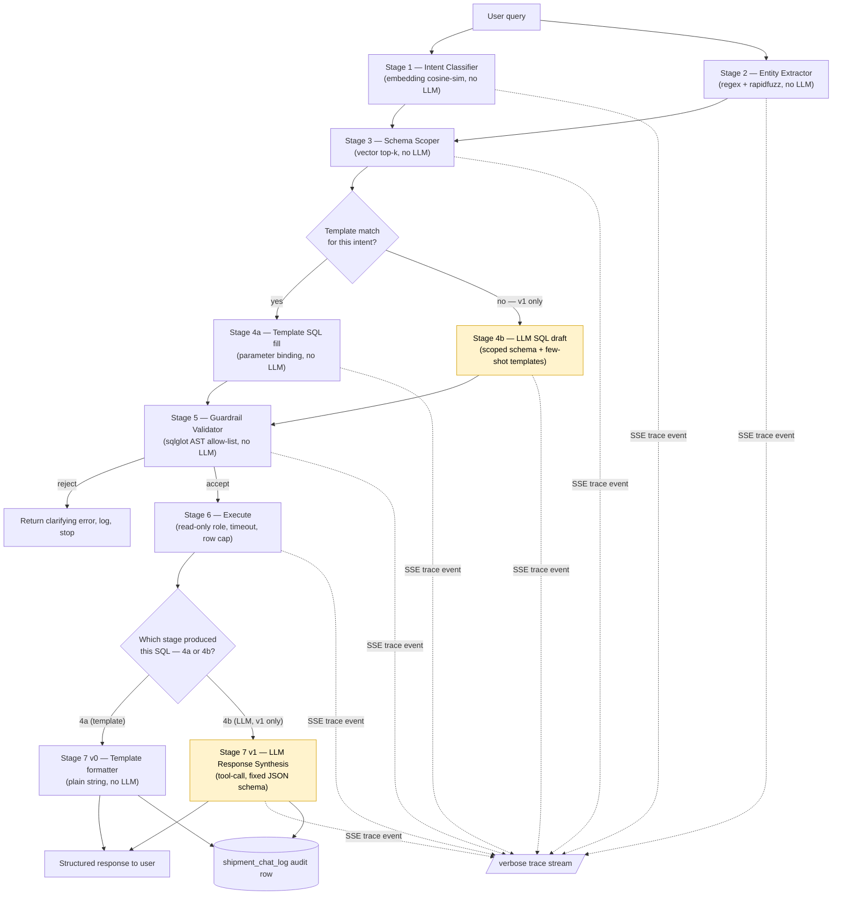

# Agentic RAG Architecture — Shipment Journey Summary Chat

Design for the AI chat feature specified in `Phase1_Shipment_Customer_Design_Document.docx`
(§4) and grounded in `02_phase1_agentic_schema.json`. Status: **v0 and v1 both fully implemented
and live-verified end-to-end**, including a genuine LLM-drafted `GROUP BY` query executing
correctly against the real database and getting synthesized into a correct natural-language
answer.

- **v0** (Stages 1-3, 4a, 5, 6, Stage 7 v0 template formatter): live in `backend/chat/`,
  tested end-to-end against the seeded database, including a corner-case audit (see §9).
- **v1** (Stage 4b LLM SQL draft, Stage 7 v1 LLM synthesis, `sql_llm.py`/`synthesize.py`/
  `llm_client.py`): live-verified with three interchangeable LLM providers, switched by
  `AGENT_LLM_PROVIDER` — **`anthropic`** (cloud, paid), **`gemini`** (cloud, free tier), and
  **`ollama`** (local, no API cost) — all three behind the exact same `call_tool()` contract, so
  `sql_llm.py`/`synthesize.py` never branch on which is active. Verified along the way: graceful
  degradation with no provider configured/
  reachable (falls through to v0's clarifying answer, no crash); the Stage 4b → Stage 5
  guardrail round-trip caught and fixed a real bug (aliased `SELECT` columns like
  `count(*) AS shipment_count` were wrongly rejected — fixed in `guardrails.py`'s
  `_select_aliases`); an `anthropic==0.39.0`/`httpx 0.28+` incompatibility that crashed on
  client construction (pinned to `0.69.0`); and a reliability gap specific to the local
  provider — Ollama's API has no Anthropic-style forced tool-choice, so the model sometimes
  responded with plain text instead of calling the tool, fixed by adding an explicit "you MUST
  call this function" instruction to both Stage 4b's and Stage 7 v1's system prompts. **A
  genuine end-to-end pass then succeeded**, live, against a local `gemma4:12b` model: "group
  shipments by package type and show how many are delayed" → correct `GROUP BY` SQL drafted →
  passed the guardrail → executed against the real 25k-row dataset → synthesized into a correct,
  natural-language answer with sensible follow-up suggestions. See §9 for the full test record.

## 1. Design principles (from requirements)

| Requirement | How this design satisfies it |
|---|---|
| Understand user query → pick right entities/relationships | Deterministic NLU stage (embeddings + fuzzy matching), not an LLM call |
| Accurate SQL generation | Template-first, LLM only fills gaps, output is AST-validated before it can touch the DB |
| Return details in an expected format | LLM's final step is a **tool-call with a fixed JSON schema**, not free text |
| Guardrails on DB access / query generation | Read-only DB role + SQL allow-list validator + row/time limits, defense in depth |
| Minimize LLM load, tokens, hallucination | Programmatic entity/schema matching narrows what the LLM ever sees to ~1 table's worth of schema |
| Visible "thinking" trace | Every pipeline stage emits a structured SSE event; gated behind a `verbose` privilege |
| Comparisons at programming level | Intent + entity + schema selection is cosine-similarity/regex/fuzzy-match code — the LLM never chooses *which* tables exist |
| Scalable | Schema knowledge lives entirely in `02_phase1_agentic_schema.json`; adding Phase 2 tables is a data change, not a code change |
| Low-risk rollout | Ship the deterministic backbone first with **zero LLM calls** (v0), add the two narrow LLM touchpoints once it's proven (v1) |

## 2. Rollout plan: v0 → v1

The pipeline is 7 stages, but only Stage 4b and Stage 7 ever call an LLM. Splitting the build
this way means the guardrails, scoping, and DB-access path get proven against the real
database **before** any LLM-generated SQL exists — the riskiest component is added last, on
top of an already-working, already-tested backbone.

| Stage | v0 — ship first (zero LLM calls) | v1 — add once v0 is live |
|---|---|---|
| 1. Intent Classifier | ✅ embedding cosine-sim against `query_patterns` | unchanged |
| 2. Entity Extractor | ✅ regex + rapidfuzz + dateparser | unchanged |
| 3. Schema Scoper | ✅ vector top-k over entities/views | unchanged |
| 4. SQL Generation | ✅ **4a only** — template fill for known intents; unmatched queries get a static "I can currently only answer questions about tracking status, delay reasons, customs, and open issues" response | ➕ **4b** — LLM drafts SQL for low-confidence/unmatched queries, given the Stage-3 entity slice *plus* the 2-3 nearest existing templates as few-shot examples (reusing Stage 1's ranking) |
| 5. Guardrail Validator | ✅ full `sqlglot` validator — runs even in v0, protecting template output too (defense in depth from day one) | unchanged, now also gates 4b's output |
| 6. Execute | ✅ pooled, read-only, timeout, row cap | unchanged |
| 7. Response Formatting | ✅ **plain string templates** per intent (e.g. `f"Your package is currently {status}..."`) — the only formatter that exists | ➕ **routed by which stage produced the SQL, not a full replacement**: Stage 4a's output still goes to Stage 7 v0 (unchanged, 0 LLM cost); only Stage 4b's output goes to the new **LLM tool-call** Stage 7 v1 |
| LLM calls per request | **0** | 0 for the 6 known intents (unchanged); up to 2 only when Stage 4b fires |
| New dependency | `sentence-transformers`, `rapidfuzz`, `dateparser`, `sqlglot`, `asyncpg`, `sse-starlette` | + Anthropic SDK |

v0 already covers the majority of expected traffic — **28** `query_patterns` intents now
defined in the schema JSON (originally 6; expanded per §10 to cover every dashboard view plus
genuine mix-and-match filters — by customer, status, package type, delivery type, and joined
customer+delay combinations — then per §12 to cover single-shipment identity lookups (who owns
it, package/service details, route, schedule, delivery attempts) and their reverse — filter the
fleet by location, package size, or pickup date) — end to end, fully guardrailed, fully
testable, with deterministic output. v1 only extends coverage to ad-hoc/analytical phrasing that
Stage 4a structurally can't
template; it does not touch Stages 1-3, 5, or 6, and — per the routing above — it doesn't touch
the response path for any of the 20 known intents either.

**Why routing, not a full swap:** Stage 4b's output has nowhere to go without *some* new
formatter — `respond_template.py`'s `_FORMATTERS` dict only has entries for the known intents,
so a novel, LLM-drafted query would otherwise hit the "I wasn't able to generate a response for
this query" fallback and silently discard correctly-fetched data. Stage 7 v1 exists to close
that gap. But making it a *full* replacement — every request pays for an LLM call, even the ones
Stage 4a already answers perfectly — would violate the "don't spend an LLM call where a
deterministic answer already works" principle for zero benefit on that traffic. Routing by
origin gets the coverage Stage 4b needs without the cost regression a full swap would cause.

## 3. Pipeline overview



Stage 7's routing decision (`S`) is not a new ranking or scoring step — it's just "which branch,
4a or 4b, produced this SQL" carried forward as a tag, the same way `sql_generated`'s `source`
field already distinguishes `"template" | "llm"` in the trace (§5).

Stages 1 and 2 have no dependency on each other — both only need the raw query text — so they
run **concurrently** (`asyncio.gather`), not strictly in sequence; Stage 3 is the first point
that needs both results. This shaves latency without changing the safety model.

## 4. Stage-by-stage detail

### Stage 1 — Intent Classifier `[v0]` (programmatic)

`02_phase1_agentic_schema.json.agent_context.query_patterns` already gives 6 intents, each
with an `example_nl`. Reuse it directly as a few-shot embedding bank instead of hand-coding
an intent list twice:

```python
# built once at startup, cached in memory — not per-request
INTENT_BANK = [
    (p["intent"], p["example_nl"], embed(p["example_nl"]))
    for p in schema_json["agent_context"]["query_patterns"]
]

def classify_intent(query: str) -> tuple[str, float]:
    q_vec = embed(query)
    intent, _, score = max(
        ((i, ex, cosine(q_vec, v)) for i, ex, v in INTENT_BANK),
        key=lambda t: t[2],
    )
    return intent, score
```

- Embedding model: **`sentence-transformers/all-MiniLM-L6-v2`** — 22 MB, runs on CPU in
  <10 ms, no external API call, no per-query cost.
- Runs concurrently with Stage 2 (see §3) — both only need the raw query text.
- In v0, if the top score is below a confidence threshold (e.g. 0.55) the query falls through
  to the static "I can currently answer..." response (see §2). In v1, the same low-confidence
  case instead routes to Stage 4b.
- This list grows by editing the JSON's `query_patterns` array — no code change.
- The scorer computes a similarity ranking over *every* template, not just the winner — v0 only
  ever reads index 0 of that ranking. v1's Stage 4b reuses the same ranking (indices 1-3, or all
  of it if index 0 didn't clear the threshold) to pick few-shot example templates — see Stage 4b.
  No new ranking logic needed, just a second consumer of the same computation.

### Stage 2 — Entity Extractor `[v0]` (programmatic)

Pulls concrete values out of the query text so the LLM never has to "remember" or invent
them. Runs concurrently with Stage 1 (see §3).

| Entity | Method | Library |
|---|---|---|
| `tracking_id` | Regex `\b\d{9,15}\b` (matches the schema's `VARCHAR(40)` numeric tracking numbers) | `re` |
| `current_status`, `issue_type`, `reason_for_delay`, etc. (enum values) | Fuzzy match against `allowed_values` arrays already listed per-field in the schema JSON | `rapidfuzz` |
| `org_name` / customer references | Fuzzy match against a cached list of `customers.org_name` (small table, ~800 rows — cache in memory, refresh periodically) | `rapidfuzz` |
| Dates ("last week", "since Monday") | `dateparser` (handles relative dates) | `dateparser` |

Every extracted value carries a match score; low-confidence extractions are surfaced in the
trace and, if load-bearing for the query, trigger a clarifying question instead of guessing.

### Stage 3 — Schema Scoper `[v0]` (programmatic — the key hallucination-reduction step)

Precompute one embedding per entity/view **description** in `02_phase1_agentic_schema.json`
at startup (5 tables + 1 grounded-context view + 9 dashboard views = 15 vectors, trivial to
hold in memory — no vector DB needed at this scale).

```python
SCHEMA_INDEX = {
    name: embed(f"{obj['description']} fields: {', '.join(obj.get('fields', obj.get('columns', {})))}")
    for name, obj in {**schema_json["entities"], **schema_json["views"]}.items()
}

def scope_schema(query: str, intent: str, top_k: int = 4) -> list[str]:
    q_vec = embed(query)
    ranked = sorted(SCHEMA_INDEX, key=lambda n: -cosine(q_vec, SCHEMA_INDEX[n]))
    return ranked[:top_k]
```

`top_k=4`, not 2 — tuned empirically, not guessed. For genuinely multi-entity questions (e.g. "group
shipments by package type and show how many are delayed"), scores 3-9 often cluster within
~0.02-0.07 of each other — there's no clean gap to cut at 2. Measured case: for that exact
query, the raw `shipment` entity (needed for `package_type`/`package_size`/`package_weight_kg`
grouping — no view exposes those columns) ranked #4 at 0.465 vs #3 `customer` at 0.469,
effectively a tie that `top_k=2` missed entirely. Getting `shipment` reliably scoped also
required rewording its schema-JSON description to explicitly name its groupable columns (raw
entity descriptions didn't originally mention them) — `top_k` alone wasn't enough; the
description and the cutoff are two separate, complementary levers, not substitutes for each
other. See §8 "Raw-table access for ad-hoc grouping" below for what this unlocks and its limits.

The result (e.g. `["shipment", "v_shipment_journey_summary"]`) is used to slice the full JSON
schema down to **only those entities' field dictionaries**. In v0 this scoped list feeds
Stage 5's allow-list even though nothing is sent to an LLM yet; in v1 it's also one of the three
inputs serialized into Stage 4b's prompt (schema slice + few-shot templates + query — see Stage
4b) — for common intents that means the LLM sees ~30 lines of schema instead of the full ~500,
directly cutting tokens and the surface area for hallucinated table/column names. Crucially,
this scoped list is also what Stage 5 validates 4b's output against — so even if a few-shot
example template shown to the model referenced a table outside this query's scope, the model's
actual output still can't touch it.

### Stage 4a — Template SQL `[v0]` (no LLM, preferred path)

Each `query_pattern` in the schema JSON already carries a `recommended_query` with `$1`-style
placeholders. For the ~80% of traffic that's "where is it" / "why is it late" /
"open issues on this shipment" / "customs status", Stage 4a just binds the Stage-2-extracted
values into that template with a parameterized `psycopg2`/`asyncpg` call. **No LLM call at
all** for these — zero token cost, zero hallucination risk. This is the only SQL-generation
path that exists in v0.

### Stage 4b — LLM SQL draft `[v1 addition]` (fallback only)

Reached only when Stage 4a returns no match — either Stage 1's intent confidence was too low,
or a required entity (e.g. `tracking_id`) was missing. Does not exist in v0 — those queries get
the static fallback response instead. Waterfall, not merge: Stage 4a is always tried first,
every time, forever — see `pipeline.py`'s `if filled is None:` branch point.

Three things go into this call, all filtered to relevance — never the full schema, and never
the full template library:

1. **The user's query**, verbatim.
2. **The Stage-3-scoped schema slice** — field dictionaries for only the entities Stage 3
   ranked highest, not the full ~500-line schema JSON. This doubles as the allow-list surface:
   the model is told "SELECT only, from the tables listed above, no other tables exist," and
   Stage 5 enforces that independently of whether the model listens.
3. **The 2-3 nearest existing templates as few-shot examples** — reusing Stage 1's *ranking*,
   not just its top-1 pick (v0 only reads index 0; this is v1's second consumer of the same
   computation). Schema tells the model *what exists*; showing it 2-3 real, already-safe queries
   tells it *how this system queries it* — parameter-binding style, which filters pair with
   which tables, house idioms — which is a different and complementary kind of grounding.

```python
def draft_sql(query: str, scoped_entities: list[str]) -> dict:
    schema_slice = {e: full_schema[e] for e in scoped_entities}   # = Stage 5's allow-list too
    nearby_templates = rank_templates_by_similarity(query)[:3]     # Stage 1's ranking, reused
    prompt = build_prompt(query, schema_slice, nearby_templates)
    return llm_tool_call(prompt, tool_schema={"sql": str, "explanation": str})
```

- **Why only the top 2-3 templates, not the whole library**: identical reasoning to Stage 3's
  schema scoping. As `sql_templates.py` grows from 6 templates today to 30, then 100, showing
  all of them would silently undo the point of scoping down — token cost would grow with the
  template library instead of staying flat, and irrelevant examples add noise the model has to
  reason past instead of useful signal.
- **Tool-use / structured output** forces the model to return `{"sql": "...", "explanation": "..."}` —
  never free-form text that has to be parsed out of a chat response.
- Model tier: a smaller/cheaper model (e.g. Claude Haiku 4.5) is sufficient here because the
  scoped schema is tiny and the task is narrow; escalate to a stronger model only if Stage 5
  rejects the SQL twice in a row.
- **Stage 5 doesn't change for this.** It validates against the Stage-3 allow-list regardless of
  which stage produced the SQL or what the few-shot example templates happened to reference — an
  example template touching a table outside this query's scope can't leak permission to the
  model's actual output.

### Stage 5 — Guardrail Validator `[v0]` (no LLM — the safety-critical stage)

Nothing generated in Stage 4a (v0) or 4b (v1) touches the database until it passes this
**static, allow-list-based validator**, regardless of source. Building this in v0 means it's
already battle-tested against real traffic before Stage 4b's LLM-generated SQL ever reaches it:

```python
import sqlglot
from sqlglot import exp

ALLOWED_TABLES = set(scoped_entities)  # from Stage 3 — narrows per-request, not just globally
ALLOWED_COLUMNS = {col for e in scoped_entities for col in schema_fields(e)}

def validate_sql(sql: str) -> str:
    statements = sqlglot.parse(sql, read="postgres")
    if len(statements) != 1:
        raise GuardrailError("exactly one statement is allowed")

    tree = statements[0]
    if not isinstance(tree, exp.Select):
        raise GuardrailError("only SELECT statements are allowed")

    tables = {t.name for t in tree.find_all(exp.Table)}
    if not tables <= ALLOWED_TABLES:
        raise GuardrailError(f"query references tables outside scope: {tables - ALLOWED_TABLES}")

    columns = {c.name for c in tree.find_all(exp.Column)}
    if not columns <= ALLOWED_COLUMNS | {"*"}:
        raise GuardrailError(f"unknown columns: {columns - ALLOWED_COLUMNS}")

    for banned in (exp.Insert, exp.Update, exp.Delete, exp.Drop, exp.Alter, exp.Into):
        if tree.find(banned):
            raise GuardrailError("write/DDL operations are not allowed")

    if not tree.args.get("limit"):
        tree = tree.limit(200)  # hard cap if the generator forgot one

    return tree.sql(dialect="postgres")
```

Defense in depth beyond static validation:

- **DB-level**: a dedicated `agent_ro` Postgres role with `GRANT SELECT` only on the 5 Phase 1
  tables + 10 views (`REVOKE ALL` on everything else, including `information_schema` where
  possible). Even a validator bug can't escalate past what Postgres itself will permit.
- **Session-level**: every agent connection runs inside `SET LOCAL statement_timeout = '3000ms'`
  and a transaction that is always rolled back (belt-and-braces — the role can't write anyway).
- **Row cap**: hard `LIMIT` enforced by the validator (auto-appended if missing).
- **Parameter binding**: Stage-2-extracted values (tracking IDs, dates, enum values) are always
  passed as bound query parameters, never string-interpolated into the SQL text — closes the
  SQL-injection path even if the LLM tried to smuggle a value through free text.
- **Confidence gate**: if Stage 1/4b confidence is low, respond with a clarifying question
  instead of executing a guessed query.

### Stage 6 — Execute `[v0]`

Async connection pool (`asyncpg`), read replica if/when available, query + params from Stage 5.
Returns rows + row count + elapsed time — all three go into the trace and the audit log.

### Stage 7 v0 — Template Response Formatter `[v0]` (no LLM)

Plain Python f-strings keyed by intent, e.g.:

```python
TEMPLATES = {
    "why_is_it_late": "Your package ({tracking_id}) is currently {current_status}. "
                       "Reason: {reason_for_delay} — {delay_comments}. "
                       "Estimated delivery: {estimated_delivery}.",
    "where_is_my_package": "Your package ({tracking_id}) is currently {current_status} "
                            "at {last_location}.",
}

def format_response(intent: str, row: dict) -> dict:
    return {
        "answer": TEMPLATES[intent].format(**row),
        "supporting_data": row,
        "confidence_score": 1.0,  # deterministic template, always "certain"
    }
```

Deterministic and instant, but only covers the fixed set of known intents/phrasings. In v1,
**this stays the formatter for every Stage-4a (template) result — it is not replaced.** Only
queries that fell through to Stage 4b (no known intent matched) route to Stage 7 v1 instead;
see the routing rationale in §2.

### Stage 7 v1 — LLM Response Synthesis `[v1 addition]` (constrained output, Stage-4b path only)

Does not replace Stage 7 v0 — it's the formatter for the one case Stage 7 v0 structurally can't
handle: a query with no matching known intent, whose SQL Stage 4b drafted instead of a template.
A second, narrow LLM call: given the row results and the original question, produce the
customer-facing answer **as a tool-call against a fixed Pydantic schema**, e.g.:

```python
class ShipmentAnswer(BaseModel):
    answer: str                     # natural-language response
    tracking_id: str | None
    current_status: str | None
    confidence_score: float         # 0-1
    supporting_data: dict           # the raw row(s), for UI rendering
    follow_up_suggestions: list[str] = []
```

Forcing structured output here (rather than parsing free text) is itself a guardrail — the
API contract to the frontend is identical regardless of which Stage 7 produced it (same
`ShipmentAnswer` shape), so the frontend never needs to know or care whether a given answer came
from Stage 7 v0 or v1 — only Stage 6's rows differ, not what either formatter hands downstream.
`confidence_score` below 0.75 flags `requires_human_review` per the design doc, and regardless of
which Stage 7 ran, every interaction (query, SQL used, rows returned, answer, confidence) is
written to `shipment_chat_log` for QA — this doubles as the system's audit trail from day one.

**Build-order note:** since Stage 7 v1 only ever receives Stage 4b's output, the two ship
together as a connected pair (see §2's dependency rationale) — but they don't have to be *built*
in lockstep. Getting Stage 4b's SQL-drafting quality solid first, with Stage 7 v1 starting as a
minimal pass-through (dump the rows into `supporting_data` with a generic "here's what I found"
answer) rather than fully tuned phrasing, isolates the higher-risk piece (does the LLM draft
safe, useful SQL?) from response-quality polish. The granular SSE trace already built in v0
supports this: `sql_generated` and `answer_ready` are separate events, so SQL-drafting
correctness and answer-phrasing quality can be inspected and iterated on independently even
though both stages ship in the same release.

## 5. Streaming the "thinking" trace `[v0]`

FastAPI + Server-Sent Events (`sse-starlette`) stream one event per pipeline stage — this
exists from v0, since most stages are already real by then:

```json
{"stage": "intent_classified", "detail": {"intent": "why_is_it_late", "confidence": 0.83}}
{"stage": "entities_extracted", "detail": {"tracking_id": "794658312457"}}
{"stage": "schema_scoped", "detail": {"entities": ["shipment", "v_shipment_journey_summary"]}}
{"stage": "sql_generated", "detail": {"sql": "SELECT * FROM v_shipment_journey_summary WHERE tracking_id = $1", "source": "template"}}
{"stage": "sql_validated", "detail": {"status": "accepted"}}
{"stage": "executing", "detail": {}}
{"stage": "rows_returned", "detail": {"count": 1, "elapsed_ms": 12}}
{"stage": "answer_ready", "detail": {"confidence_score": 0.91}}
```

`source` on the `sql_generated` event is `"template"` in v0 always, and `"template" | "llm"`
once v1 adds Stage 4b — the trace format doesn't change between versions.

This is a **privilege**, not a default: `verbose=true` is only honored for roles like
`SUPPORT`/`OPS`/`ADMIN` (checked server-side against the authenticated session, not a client
flag) — end customers only ever receive the final `answer_ready` payload. Gate this in the
route handler before the SSE generator starts emitting intermediate events.

## 6. Suggested backend module layout

Extends the existing `backend/` FastAPI app rather than a separate service:

```
backend/
├── main.py                      # existing hello/health/summary endpoints
├── chat/
│   ├── router.py                 # POST /api/chat (SSE), GET /api/chat/history        [v0]
│   ├── intent.py                 # Stage 1                                             [v0]
│   ├── entities.py               # Stage 2                                             [v0]
│   ├── schema_scope.py           # Stage 3 (+ startup-time embedding cache)             [v0]
│   ├── sql_templates.py          # Stage 4a — query_patterns -> parameterized SQL       [v0]
│   ├── guardrails.py             # Stage 5 — sqlglot validator, allow-lists             [v0]
│   ├── executor.py               # Stage 6 — pooled read-only execution                 [v0]
│   ├── respond_template.py       # Stage 7 v0 — plain string formatter per intent       [v0]
│   ├── trace.py                  # SSE event emission helpers                           [v0]
│   ├── pipeline.py               # orchestrates the stages, no framework                [v0, extended in v1]
│   ├── sql_llm.py                # Stage 4b — LLM SQL draft (schema slice + few-shot templates) [v1]
│   └── synthesize.py             # Stage 7 v1 — structured-output LLM call              [v1]
└── schema/
    └── 02_phase1_agentic_schema.json   # single source of truth, loaded at startup
```

`pipeline.py` is intentionally a plain sequential async function, not a LangChain/LangGraph
agent — the control flow is fixed (this is the "keep comparisons at programming level"
requirement), so a graph/agent framework would add indirection without adding capability at
this scale. Going from v0 to v1 is two new files and a couple of `if` branches in
`pipeline.py` (route to 4b when no template matches; call `synthesize.py` instead of
`respond_template.py`), not a rewrite.

## 7. Tech stack summary

| Concern | Choice | Needed from |
|---|---|---|
| API framework | FastAPI (already in repo) | v0 |
| Embeddings | `sentence-transformers` (`all-MiniLM-L6-v2`) | v0 |
| Fuzzy matching | `rapidfuzz` | v0 |
| Date parsing | `dateparser` | v0 |
| SQL parsing/validation | `sqlglot` | v0 |
| DB access | `asyncpg` (or existing `psycopg2` for parity) | v0 |
| Streaming | `sse-starlette` | v0 |
| Audit | `shipment_chat_log` table (already in schema) | v0 |
| LLM calls | Anthropic Python SDK (`anthropic==0.69.0` — 0.39.0 crashes, see §9), `google-genai` (Gemini), **or** `ollama` Python client, switched by `AGENT_LLM_PROVIDER` — same `call_tool()` contract either way | **v1 only** |

## 8. Scalability path

- **New entities**: adding Phase 2 tables (packages, carriers, route_legs, …) means adding
  them to the schema JSON and re-running the startup embedding cache build — the NLU/scoping
  stages need no code changes.
- **Vector index growth**: an in-memory cosine-similarity loop is fine for ~15-50 entities/views;
  if Phase 2+ grows this materially, swap `schema_scope.py`'s backing store for `pgvector` or
  FAISS without touching Stages 1/2/4-7.
- **More agents**: `agent_context.recommended_agents` in the schema JSON already anticipates
  multiple specialized agents (journey-summary, dashboard-summarizer). Each new agent reuses
  Stages 1-6 unchanged and only needs its own Stage 7 output schema.
- **Governance**: today `shipment_chat_log` is the sole audit surface, matching Phase 1 scope.
  If a later phase needs the deferred `agent_action_log` governance ledger (see the design
  doc's roadmap), the trace events already emitted in §4 are the natural source rows for it —
  no pipeline redesign, just an additional sink.

### Raw-table access for ad-hoc grouping/reporting

The 10 dashboard views are fixed projections — `v_shipment_journey_summary` exposes 16 of the
`shipments` table's 27 columns, and none of the views expose `package_type`, `package_size`,
`package_weight_kg`, `failed_delivery_attempts`, or the pickup/delivery windows at all. A
question like *"group shipments by package type and show how many are delayed"* structurally
cannot be answered from any existing view — those columns just aren't there.

Two ways to unblock a question like that, not mutually exclusive:

1. **Add a new dashboard view** — a `CREATE VIEW` for that specific shape, e.g.
   `v_package_type_delay_breakdown`. Zero pipeline changes (Stages 1-7 don't know or care that a
   view is new — it's just one more scoreable entity in the schema JSON), works in v0 via a new
   `sql_templates.py` entry, and gets proper indexing if it turns out to be asked often. Costs a
   DB migration and only covers the one shape you wrote. Regular views store no data of their
   own (`pg_relation_size` on any of the 10 existing views is 0 bytes — confirmed on the live
   DB) — they recompute from the real tables on every read, so adding more of them doesn't grow
   database storage, only (potentially) query cost at very large table sizes.
2. **Let Stage 3 scope to the raw `shipment` entity instead of a view**, and (once v1 exists)
   let the LLM write its own `GROUP BY` directly against it — `shipment` is already one of the 5
   allow-listed entities with all 27 raw columns in its field dictionary, so this needs zero DB
   changes. This is what `top_k=4` (§4 Stage 3) and the `shipment` description rewording were
   tuned for. **Current limits, worth being explicit about:** (a) it only pays off once v1's
   Stage 4b exists — v0's fixed templates can't construct an arbitrary `GROUP BY` no matter how
   the schema is scoped; (b) it's unindexed ad-hoc aggregation — fine at 25k rows, a full-table
   scan at millions; (c) reliably surfacing the right raw entity depends on Stage 3's ranking,
   which is embedding-similarity-based and was empirically tuned for one example query — a
   materially different phrasing could still miss it, the way `top_k=2` originally did here.

Rule of thumb: raw-table access is the general-purpose fallback for questions you didn't
anticipate; a dedicated view is the right call once a specific grouping turns out to be asked
often enough to be worth optimizing and guaranteeing.

## 9. Corner-case audit (v0)

Ran a live test matrix against the running system rather than reasoning about it in the
abstract. Principle applied throughout: **quality is not traded away to save an LLM call.**
Every fix below is v0-fixable (zero LLM cost) precisely because the risk was in the *gating
logic*, not in Stage 4a/5/6 — a template execution is provably safe (parameterized, guardrailed)
regardless of how confident the intent match was, so being overly conservative about *attempting*
one only threw away quality for no safety benefit. Where a gap turned out to be structural
rather than a gating bug, it's flagged as a genuine v1 requirement instead of being
papered over with more templates.

### What was tested and found

| Query | Before | After | Fix |
|---|---|---|---|
| `"Where is my package 999999999999?"` (real phrasing, nonexistent ID) | Declined — confidence 0.515 < old threshold 0.55 | Correct "not found" answer | Threshold 0.55→0.40 |
| `"has 800000000131 cleared customs yet"` | Declined — 0.526 < 0.55 | Correct `customs_status` answer | Threshold 0.55→0.40 |
| `"My order 800000000131 seems stuck, what's happening"` | Declined — 0.455 < 0.55 | Correct `why_is_it_late` answer | Threshold 0.55→0.40 |
| `"wheres 800000000131"` (casual/typo) | Declined — 0.51 < 0.55 | Correct answer | Threshold 0.55→0.40 |
| `"800000000131"` (bare ID, no verb) | Declined — 0.281, below even the new threshold | Defaults to `where_is_my_package` | New: single-tracking-ID fallback (`pipeline.py`'s `intent_defaulted` branch) |
| `"tell me about shipment 800000000131"` | **New failure introduced by the threshold drop**: matched `ops_daily_briefing` (0.467) — a fleet-wide intent that ignores `tracking_id` — returned a completely irrelevant aggregate report | Overridden to `where_is_my_package`; correct answer | New: fleet-intent override guard — a `tracking_id` in the query is treated as decisive evidence against a fleet-wide match |
| `"Compare shipment 800000000131 and 900000000005..."` | Silently answered about only the first ID — **confidently incomplete**, no indication the second was ignored | Honest decline: "I can look up one shipment at a time... which one?" | New: multi-tracking-ID detection (`entities.py`'s `tracking_ids` list + `pipeline.py`'s pre-routing guard) |
| `"Where is my package 999999999999?"` (again, deeper look) | **Separate bug, unrelated to threshold**: crashed mid-stream with `ForeignKeyViolation` on the audit-log insert — user got nothing, not even the decline message | Answer streams fully; audit row written with `tracking_id=NULL` | `audit.py`: catch `ForeignKeyViolation`, retry once with the unverified reference nulled out — audit logging must never crash the primary response |
| 7 out-of-domain queries ("weather", "reset my password", "tell me a joke", ...) | Correctly declined (0.06-0.304) | Still correctly declined — confirmed no regression from lowering the threshold | Measured the gap first (§4 Stage 1/3) before tuning, not guessed |
| 6 known-good phrasings (one per intent) | Worked | Still work, unchanged | Regression-checked after every fix |

### The FK-violation bug is worth calling out on its own

It wasn't found by reasoning about the design — it was hiding in a table already, from the
very first corner-case test run of this session, and silently swallowed a broken response.
`shipment_chat_log.tracking_id` is a real foreign key to `shipments.tracking_id`
(`ON DELETE SET NULL`). Stage 2 extracts a tracking_id from raw query *text* — it is never
confirmed against the database until Stage 6 runs. Whenever that text doesn't match a real
shipment (typo, cancelled order, made-up number), `_finish()` was passing the unverified value
straight into the audit INSERT, which Postgres correctly rejected — and the unhandled exception
took the whole SSE stream down with it, well after the correct answer ("I couldn't find a
shipment...") had already been computed and was one yield away from reaching the user. This is
the sharpest illustration of the audit rule adopted in the fix: **logging is a side effect and
must never be allowed to crash the primary response the user is waiting on.**

### What was a genuine v0 boundary — now implemented in v1, not yet live-verified

These were the concrete, evidence-based v1 priority list from the v0 audit — not hypothetical.
Stage 4b/7-v1 now exist and are wired to handle all three, but none has been exercised against
a real LLM call yet (no API key was available in the build environment — see below):

- **Ad-hoc grouping/reporting** ("group shipments by package type...") — this is what actually
  drove `guardrails.py`'s `_select_aliases` fix (found via a mocked Stage 4b response using
  exactly this query — see §4 Stage 5). Code path is exercised and correct against that mock;
  untested against what a real model actually drafts for it.
- **Genuinely novel phrasing outside all 6 known shapes** — now routes through Stage 4b instead
  of immediately declining. The confidence floor (0.40) for the *template* path is unchanged and
  still correctly gates Stage 4a; Stage 4b is the fallback for what it doesn't catch.
- **True multi-shipment comparison** ("which of these two is more delayed and why") — **still
  not handled.** The multi-tracking-ID guard in `pipeline.py` intercepts these *before* Stage 3
  even runs, by design (see the corner-case audit above), so they never reach Stage 4b at all.
  This remains a real gap — closing it means teaching the multi-ID guard to route into Stage 4b
  (multiple queries + cross-result synthesis) instead of always declining, which hasn't been
  built. Worth flagging as the next concrete piece of scope, not silently left open.

### v1 live verification — full test record

**Provider abstraction.** `llm_client.py` supports three providers behind one `call_tool()`
contract, switched by `AGENT_LLM_PROVIDER`:
- `anthropic` — cloud, needs `ANTHROPIC_API_KEY` + account credit. Supports forced tool-choice
  (`tool_choice={"type": "tool", "name": ...}`), so the model has no way to respond without
  calling the function.
- `gemini` — cloud, needs `GEMINI_API_KEY`, free tier available (get one at
  https://aistudio.google.com/apikey). Also supports forced function-calling
  (`tool_config.function_calling_config.mode="ANY"` + `allowed_function_names`), same reliability
  guarantee as Anthropic's forced tool-choice. Uses `AGENT_GEMINI_MODEL` (default
  `gemini-3-flash-preview` — the 2.x stable models returned "not available to new users"/zero
  free-tier quota when tested against a fresh API key; the 3.x preview line is what's actually
  reachable on a new project's free tier). Schema translation needed one adjustment:
  Gemini's `FunctionDeclaration.parameters` is an OpenAPI-style Schema with no JSON-Schema
  `"type": ["string", "null"]` union — `_to_gemini_schema()` recursively rewrites that as
  `type: <that type>` + `nullable: true` so callers' plain JSON-Schema tool definitions (shared
  with the Anthropic/Ollama path) never need a Gemini-specific variant.
- `ollama` — local, needs `ollama pull <model>` already done on the host and a model with tool-
  calling support (confirmed via `capabilities` in `ollama list` / `/api/tags`). Reached from
  inside the backend container via `host.docker.internal` (an explicit `extra_hosts` mapping in
  `docker-compose.yml` makes this work on native Linux Docker too, not just Docker Desktop).
  **No forced tool-choice exists in Ollama's API** — the model decides on its own whether to
  call the tool, which is a real reliability gap smaller/local models can have.

**Bugs found and fixed via actual live calls, not mocks:**
1. `anthropic==0.39.0` crashed on client construction (`TypeError: unexpected keyword argument
   'proxies'`) — incompatible with the `httpx 0.28+` this project's other dependencies pull in.
   Pinned to `0.69.0`.
2. The local model (`gemma4:12b-it-q4_K_M`) intermittently responded with plain text instead of
   invoking the tool — expected, given Ollama has no forced-tool-choice lever. Fixed by adding
   an explicit "You MUST respond by calling the `{tool_name}` function — never respond with
   plain text" instruction to the end of both Stage 4b's and Stage 7 v1's system prompts. This
   is a provider-agnostic addition (harmless for Anthropic, which already forces tool choice;
   load-bearing for Ollama, which doesn't) — no per-provider prompt branching needed.

**A genuine end-to-end pass succeeded, live, after those fixes**, using the local Ollama
provider (`gemma4:12b-it-q4_K_M`) — chosen specifically because the whole point of Stage 4b is
raw-table grouping the fixed templates can't do:

> Query: *"Group shipments by package type and show how many are delayed"*
> Stage 4b drafted: `SELECT package_type, COUNT(*) AS delayed_count FROM shipments WHERE reason_for_delay <> 'NONE' GROUP BY package_type LIMIT 200;`
> Stage 5: accepted (this exact aliased-column shape is what the `_select_aliases` fix above was for)
> Stage 6: 6 rows, 40.7ms, real data from the seeded dataset
> Stage 7 v1 answer: *"The number of delayed shipments for each package type is as follows: CRATE (977), CUSTOM (987), ENVELOPE (990), PALLET (974), TUBE (1011), and BOX (946)."* — confidence 1.0, plus two sensible follow-up suggestions.

Regression-checked immediately after: all 6 v0 intents still resolve correctly and instantly via
Stage 4a (a second live query correctly matched an existing template and never invoked the LLM
at all — confirming the waterfall still prefers the free, deterministic path even with a working
LLM provider configured), `/health` still passes, the DB guardrail still blocks writes, zero
unexpected errors in logs.

**Genuinely still open** (not blocking, but not exercised by the test runs so far):
- Broader coverage across a wider range of real questions and result shapes than the ones tested
  — each success below fixed exactly one demonstrated gap; more phrasings likely surface more.
- Real latency and token/cost characteristics under production-like traffic (local inference in
  particular varies a lot by hardware — successful runs above took well over a minute).
- The Ollama tool-choice reliability gap is *mitigated* (explicit prompt instruction), not
  *eliminated* — it's still possible for a local model to occasionally respond without calling
  the tool even with the instruction present; the waterfall degrades this to v0's clarifying
  answer rather than a crash, but it's a soft-failure rate worth monitoring, not zero.

### Two more real bugs found via live testing (both fixed, both verified)

**Bug: case-sensitivity mismatch produced a false "not found."** Query: *"How many
international shipments are currently held in customs?"* Stage 4b correctly picked
`v_domestic_vs_international` and drafted `WHERE shipment_scope = 'international'` — but the
view's actual data is `'INTERNATIONAL'` (uppercase, from a `CASE WHEN...` expression). Postgres
string comparison is case-sensitive, so this silently matched zero rows instead of erroring.
Stage 7 correctly reported low confidence rather than fabricating a count — but the root cause
was a real gap in what the model was shown: `describe_entities()` was silently dropping the
schema JSON's `"grain"` field for views, which is exactly where this project already documents
value casing (`"one row per shipment_scope (DOMESTIC/INTERNATIONAL)"`). Fixed by including
`grain` in the view description block, plus a general "category/status values are UPPERCASE
unless stated otherwise" rule added to Stage 4b's prompt as defense for columns without an
explicit `grain` hint. Retested live: correct SQL, correct answer (510), confidence 1.0.

**Gap: aggregate views structurally can't answer "give me N individual records."** Query:
*"give me 5 shipments are currently held in customs?"* Stage 3's ranking put the raw `shipment`
entity at #6 (0.404), just outside `top_k=4` — so Stage 4b was never shown a table it could list
individual rows from, and correctly used the best of what it *was* given (the aggregate view,
which only has a count column). Stage 7 again caught this honestly (0.3 confidence, "doesn't
contain a list of five separate shipments") rather than inventing shipment IDs — but the
underlying gap is structural, not a near-tie `top_k` can reliably catch: **"list N things" is a
different signal than topical similarity, and no amount of embedding tuning captures it.**

Fixed with a targeted, signal-based rule rather than another blanket `top_k` increase (see
`schema_scope.py`'s `_wants_individual_records`): force the raw `shipment` entity into scope,
independent of its ranking, whenever the query either (a) references a **specific identified
thing** — a `tracking_id`, a fuzzy-matched customer name, or a fuzzy-matched city (new — mirrors
the existing `org_name` cache pattern, querying distinct `src_loc`/`dest_loc` cities from the
live data since there's no fixed enum to match against for free-text locations), or (b) uses
**explicit list/enumeration phrasing** ("give me N", "list", "show me", "which shipments").
Both signal "this needs one-row-per-record data" regardless of how the aggregate views score
topically. The trace surfaces this via a new `forced_entities` field on `schema_scoped`, kept
separate from the ranked entities so it's clear *why* something was included, not just that it
was. Verified: correctly force-includes `shipment` for the failing query and stays inert for
both a query where `shipment` was already naturally ranked (no redundant forcing) and a
genuinely out-of-domain query (no false trigger). Retested live end-to-end: correct SQL against
the raw table (`WHERE customs_status = 'HELD' LIMIT 5`), 5 real tracking IDs returned, all
verified against the database, confidence 1.0. Full v0/v1 regression suite re-run clean after
both fixes.

## 10. Template library expansion: 6 → 20

Audited the full schema (5 entities, 10 dashboard views) against what was actually templated and
found the gap was large: only 2 of 10 dashboard views had a Stage 4a template pointing at them
(`v_open_issues_summary`, `v_top_customers`), and every template was either a single-tracking-ID
lookup or a zero-filter fleet aggregate — no template combined a filter with a JOIN, or filtered
by anything other than `tracking_id`. Every other realistic question (by customer, by status, by
package type, by delivery type) was silently falling through to Stage 4b every single time,
paying LLM latency/cost for patterns common enough to deserve a zero-cost template.

**Added 14 templates** (`sql_templates.py`, `respond_template.py`, and 14 new `query_patterns`
entries in the schema JSON — Stage 1 needs an `example_nl` to route to each one, same as any
other intent):

- **8 zero-param, one per previously-unwired dashboard view**: `dashboard_headline`,
  `status_breakdown`, `ontime_performance`, `delay_reason_breakdown`,
  `domestic_vs_international_split`, `daily_volume_trend`, `service_level_mix`,
  `chat_activity_summary`.
- **6 mix-and-match, using entities Stage 2 already extracts**: `shipments_by_customer` and
  `shipments_by_customer_delayed` (both genuine JOINs on `org_name` — the second is the exact
  "which of this customer's shipments are delayed" case from the original raw-table-access
  discussion in §8), `shipments_by_status`, `shipments_by_package_type`,
  `shipments_by_delivery_type` (all filtered on a newly-fuzzy-matched enum field), and
  `failed_delivery_shipments` (zero-param, `failed_delivery_attempts > 0`).

`FilledTemplate`/`TemplateSpec` were generalized from a single `table_key: str` to
`entity_keys: tuple/list` so JOIN templates (touching both `shipment` and `customer`) fit the
same shape Stage 4b already needed for multi-entity scopes — no special-casing in `pipeline.py`
or `guardrails.py` for "how many tables does this template touch."

### Three real bugs found running all 20 live — none were in the new template SQL itself

**1. Enum matching was completely non-functional from day one**, for every enum field, not just
the new ones. Two independent, compounding bugs, both in `entities.py`:
- `process.extractOne` is case-sensitive without an explicit `processor` — `"lost"` vs `"LOST"`
  scored 0.0. Silently broken since the very first enum-matching code in this project, but
  invisible until now because no earlier template ever gated on `enum_matches` as its *sole*
  required entity.
- The token regex `[A-Za-z][A-Za-z_ ]{2,}` allows spaces in the character class, so on any query
  with no digits/punctuation to break it up, it greedily swallows the **entire query** into one
  "token" — comparing a 30-character phrase against a 4-character candidate never scores close
  to threshold. Fixed by replacing ad hoc tokenization with proper 1-to-3-word n-grams compared
  via `fuzz.ratio` (whole-phrase similarity) against underscore-normalized candidates
  (`"LOST_PACKAGE"` → `"lost package"`) — deliberately *not* `fuzz.partial_ratio` (substring
  search) against the whole query, which was tried first and caused a different failure: "pallet
  package shipments" scored 83 against `LOST_PACKAGE` purely because "package" is a literal
  substring, with zero conceptual relation. `org_name`/`location` matching got the same
  `processor` fix for consistency (case-insensitive company-name matching wasn't reliable
  either, e.g. `"bass inc"` vs `"Bass Inc"` scored right at the threshold boundary — 80.0 exactly
  — pure luck, not a designed margin).
- One accepted, harmless side effect: short, morphologically-related words (`"delivery"` vs
  `"DELIVERED"`) can produce a spurious match on an *unrelated* field (e.g. `current_status`
  getting `DELIVERED` set alongside the correct `delivery_type=EXPRESS` for "express delivery
  shipments"). Confirmed harmless: Stage 1 already independently classifies the correct intent
  from the whole query, and each template's param builder only reads its own specific
  `enum_matches` key — the noise sits unused.

**2. The guardrail's alias handling didn't cover nested subqueries.** Surfaced fixing bug #3
below: a two-subquery `FULL OUTER JOIN` rewrite was rejected as "unknown column: cnt" — `cnt`
was a derived table's internal alias, and `_select_aliases` only scanned the outermost SELECT
list. Fixed by walking every `exp.Select` in the tree (`tree.find_all(exp.Select)`), not just
the top-level one. Same non-weakening argument as the original alias fix: an alias, at any
nesting depth, can only ever refer to a value its own SELECT list already computed from
already-checked real columns.

**3. `v_daily_volume_trend` is a genuine performance trap** — ~12.7s against the seeded 25k-row
dataset, reliably exceeding `agent_ro`'s `statement_timeout`, invisible until this session
because nothing had ever actually queried it. Root cause: its `generate_series` spans the
*entire* min-to-max date range in the data (not just "recently"), `LEFT JOIN`ing the full
`shipments` table twice per day with a `created_at::date`/`delivery_date::date` join condition
that can't use the existing (non-functional) indexes. Rather than risk a live view/DDL rewrite
under time pressure (the immutable-index route needs the view's cast to match a
timezone-fixed index expression exactly), the `daily_volume_trend` template was pointed at a
bounded rewrite instead: two independently-filtered subqueries (`created_at >= CURRENT_DATE -
14`, `delivery_date >= CURRENT_DATE - 14`), each a plain indexed range scan, combined with a
`FULL OUTER JOIN`. Measured: **12.7s → 20ms.**

That timeout is also what exposed a fourth, more general gap: **`executor.py` had no error
handling at all.** A validated-safe query can still fail at runtime (this timeout is the
demonstrated case, but a deadlock or any other transient DB error would do the same) — and
because nothing caught it, `psycopg2.errors.QueryCanceled` propagated uncaught and crashed the
SSE stream, the exact same failure shape as the audit-log foreign-key crash from the original
corner-case audit (§9), just in a different stage. Fixed with the same pattern: a dedicated
`ExecutionError` raised from `execute_query()`, caught in `pipeline.py` alongside the existing
`GuardrailError` handling, degrading to a clean decline instead of crashing.

### Verification

All 20 templates checked against the real schema/guardrail locally (fast, no LLM) before any
live test — 0 failures. Live-tested with paraphrased (not exact-copy) phrasings for all 20 —
correct intent, `source: "template"`, correct SQL, correct final answer, cross-checked against
the database for the enum-filtered and JOIN cases. Full regression re-run after every fix
(corner-case audit's 4 scenarios, DB write guardrail, `/health`) — clean throughout. Backend
error log: 7 unhandled exceptions during this round (all `QueryCanceled`, all from the same
`daily_volume_trend` root cause) → 0 after the fix.

## 11. The tracking_id default shortcut was over-eager — confirmed wrong answer, fixed

Live query: *"what was the previous stage of 400000000154"*. Routing was correct end to end
(low Stage 1 confidence, tracking_id extracted, bare-ID default fired) but the **answer was
wrong**: the fixed `where_is_my_package` template always reports *current* status, so the
response confidently stated the current stage while the question asked for the *previous* one
— the actual answer (`AT_CONNECTING_HUB`, the entry before the current one) was sitting right
there in the already-fetched `journey_timeline`, just never consulted, because the fallback
that routed here doesn't know what was actually asked, only that a tracking_id was present.

**Two shortcuts shared this root assumption**, both in `pipeline.py`, both keyed only on
`extracted.tracking_id`:
- The bare-ID default (`if resolved_intent is None and tracking_id: default to
  where_is_my_package`).
- The fleet-intent override guard (§9's corner-case audit fix — redirects a confidently-matched
  fleet-wide intent to a shipment-scoped lookup when a tracking_id is present).

Neither `org_name` nor `location` has an equivalent shortcut — an unmatched query mentioning
either already fell straight through to Stage 4b before this fix, so nothing needed extending
there; this was specifically a tracking_id-shortcut problem.

**Fix:** `_is_minimal_query()` distinguishes "genuinely bare" (`"800000000131"`,
`"wheres X"`) from "a real, specific question that happens to mention a tracking_id"
(`"what was the previous stage of X"`) by word count after stripping the tracking_id(s) out —
tuned to `<= 4` words specifically so it doesn't regress the two corner-case-audit queries that
motivated the original shortcuts (`"tell me about shipment X"`, `"give me details about X"` —
both exactly 4 words). Below the threshold, behavior is unchanged (instant, free, correct).
Above it: the bare-ID default no longer fires at all (falls through to Stage 4b naturally,
since `resolved_intent` stays `None`); the override guard clears the fleet-wide match instead
of forcing a shipment-scoped one (`resolved_intent = None`), for the same reason — forcing
*either* specific interpretation on a genuinely ambiguous, longer query is worse than letting
Stage 4b (which already gets the right raw entity scoped in via Stage 3's identity forcing)
decide from the real schema and the real question.

Verified: all 4 previously-passing regression queries (2 per shortcut) unchanged. The bug query
now correctly skips the default and reaches Stage 4b — confirmed via trace
(`default_skipped_too_specific` → `llm_sql_fallback_attempting`). On this run, Stage 4b's LLM
call itself didn't produce a usable query (Ollama's known no-forced-tool-choice reliability gap
from §9, likely worsened by the ~300 requests/10min of concurrent load observed on this shared
instance during testing) — but critically, **the failure mode is now an honest decline**
(`"I can currently help with..."`), not a confident wrong answer. That's the actual fix: this
change is about correctness of the *routing decision*, not a guarantee that Stage 4b's model
call succeeds every time — that's the pre-existing, separately-documented reliability gap in
§9, unaffected by and orthogonal to this fix. Full regression (all 20 templates' core paths,
multi-ID guard, not-found handling, DB write guardrail, `/health`) re-run clean, 0 backend
errors.

## 12. Template library expansion: 20 → 25, plus two embedding-collision fixes

Live query while testing the new frontend chat panel: *"who is the customer for 800000000010"*.
Routing looked plausible (a tracking_id present, Stage 1 matched *something* above threshold)
but the answer was **confidently wrong** — `where_is_my_package` (0.452 confidence) answered
with current status, never mentioning the customer at all, because **no template existed** for
"who owns this shipment." Unlike §11's bug, this wasn't a routing-logic defect — the classifier
did exactly what it's supposed to do (pick the closest match above threshold); the fix is a
missing *destination* to route to, not a fix to the routing rule.

**Audited the full `shipments`/`customers` schema for the same shape of gap** — a single-
tracking-id "identity" question with no template — and found four more: package contents/
service level, origin/destination, pickup/delivery scheduling, and failed-delivery-attempt
history. All were previously only reachable (if at all) by accidentally matching an unrelated
template, exactly like the customer-lookup case. Added five new zero-LLM templates, each
`required=("tracking_id",)`, each wired through Stage 4a → Stage 5 (guardrail, allow-listed
against the existing `shipment`/`customer` entity fields — no schema changes needed) → Stage 7's
template formatter:

| Intent | Answers | Entities touched |
|---|---|---|
| `shipment_customer_lookup` | Which customer owns this shipment (org name, account ID, contact) | `shipment`, `customer` |
| `shipment_package_details` | Package type/size/weight/description, service level, order ID | `shipment` |
| `shipment_route` | Origin and destination (city/state/country), domestic vs. international | `shipment` |
| `shipment_schedule` | Pickup date/window, delivery window, ETA | `shipment` |
| `shipment_delivery_attempts` | Failed delivery attempt count and last attempt time | `shipment` |

**Two embedding-collision bugs surfaced during regression, both fixed by rewording
`example_nl`** (the fix is always data, in `02_phase1_agentic_schema.json`, never code — see §1's
"growing the intent set is a JSON edit" principle):

1. `top_customers_by_volume` lost to `daily_volume_trend` for *"show me top customers by
   volume"* (0.529 vs. unmeasured-but-lower) — its example (`"Who are our top shippers and
   how's their on-time rate?"`) never used the words "customers" or "volume" that the intent's
   own name implies users will actually type. Reworded to `"Show me our top customers by
   shipment volume and their on-time rate."` → now wins at 0.775, `daily_volume_trend` unaffected
   (0.697–0.971 across its own paraphrases).
2. `shipment_package_details` lost to `shipment_customer_lookup` for *"What delivery service is
   tracking number X using?"* (0.765 vs 0.642) even after one rewording attempt — trailing
   clauses ("...and how much does it weigh?") measurably *diluted* the match rather than
   strengthening it. Root cause: `all-MiniLM-L6-v2` at these short lengths is weighing sentence
   *structure* as much as specific nouns, so a compound multi-clause example splits its own
   similarity mass across all the things it mentions. Fixed by leading with the exact phrase
   most likely to appear in a real query (`"What delivery service level and package type is
   tracking number X using?"`) and cutting the trailing clause — verified against both the
   original failing query (0.830, now #1) and a previously-untested short paraphrase ("What kind
   of package is X?", 0.602, now #1) using the same rewording, confirming the fix generalizes
   rather than overfitting to one exact sentence.

**Methodology note for future template/intent additions:** don't just eyeball an `example_nl`
and hope — use `intent.rank_intents(query)` directly (`docker exec <backend> python -c
"from chat import intent; ..."`) to see the full ranked list and exact scores before and after a
wording change. This turned what would have been trial-and-error against the live HTTP endpoint
into a fast, deterministic offline loop (embeddings are pure functions of the text — no DB, no
pipeline, no LLM call needed to iterate).

Verified end to end (not just `rank_intents` scores): all 5 new templates' canonical phrasings
return correct, well-formed answers via `/api/chat` through the nginx proxy — including the
originally-reported query. Full regression re-run: all 12 tracking-id-anchored intents
(`where_is_my_package`, `why_is_it_late`, `customs_status`, `open_issues_for_shipment`, and the
5 new ones, plus 3 unrelated fleet-wide intents used as distractors) classify to the correct
intent with confidence comfortably clear of the runner-up. Template count: 20 → 25.

### 12.1 The other half: reverse lookups, and a latent Stage 2 bug they exposed

Five new templates all answer "given a tracking_id, what's its X" — the natural next question
is "vice versa": given X, which shipments match? Checked each of the five against the existing
19 templates:

| Forward (tracking_id → X) | Reverse (X → shipments) | Status |
|---|---|---|
| `shipment_customer_lookup` | `shipments_by_customer` | already existed |
| `shipment_package_details` (type, service) | `shipments_by_package_type`, `shipments_by_delivery_type` | already existed |
| `shipment_delivery_attempts` | `failed_delivery_shipments` | already existed |
| `shipment_route` (origin/destination) | — | **missing** |
| `shipment_package_details` (size) | — | **missing** (only `package_type` had a filter, not `package_size`) |
| `shipment_schedule` (pickup date) | — | **missing** |

The first three "already existed" because §10's mix-and-match expansion happened to cover them.
The last three are genuine gaps — and notably, `entities.py` (Stage 2) already extracts
`location` and `dates` on every query (has since an earlier session), but **no template had ever
consumed either field** — they were computed, included in the trace, and then silently unused.
Added three more zero-LLM templates to close this:

| Intent | Filters on | Param source |
|---|---|---|
| `shipments_by_location` | `src_loc->>'city'` or `dest_loc->>'city'` | `entities.location` (already extracted, previously unused) |
| `shipments_by_package_size` | `package_size` | `entities.enum_matches["package_size"]` (already extracted, previously unused as a filter) |
| `shipments_by_pickup_date` | `pickup_date` | `entities.dates[0]` (already extracted, previously unused) |

**Wiring up `shipments_by_pickup_date` exposed a real, previously-latent Stage 2 bug**: the query
*"Which shipments are scheduled for pickup on July 17th?"* classified correctly
(`shipments_by_pickup_date`, confidence 0.966) but `entities.dates` came back empty, so the
template's required param was missing and it silently fell through to the (slow, Ollama-backed)
Stage 4b path instead. Root cause: `entities.py` was calling `dateparser.parse(query, ...)` —
that function requires **the entire input string** to be a date expression and returns `None`
for a date embedded in a normal sentence, which is every real query. It happened to work
whenever tested in isolation (`"July 17th"` alone) and had silently returned `None` for every
*real* query, forever — invisible until now because nothing had ever consumed `entities.dates`
before this template. Fixed by switching to `dateparser.search.search_dates()`, the substring-
extraction API. That introduced its own false positive on first pass — `languages` unset makes
`search_dates` try every locale dateparser ships, and it matched the bare word "me" as a date
(some non-English locale's format) inside *"Show me all our large shipments"*, unrelated to any
date question. Fixed by pinning `languages=["en"]`, verified against both the original bug query
and the false-positive query, plus a spot-check of relative dates ("tomorrow", "yesterday") and
several unrelated tracking-id queries (no spurious matches).

Verified end to end: all three new templates return correct results via `/api/chat`
(`shipments_by_location` for "Seattle" — 20 rows, correctly matching either leg of the route;
`shipments_by_package_size` for "large and extra-large" — fuzzy-matches to `LARGE`, consistent
with the existing single-best-match enum design elsewhere; `shipments_by_pickup_date` for "July
17th" — 20 rows, all `pickup_date = 2026-07-17`). Full regression re-run across all 15
tracking-id, reverse-lookup, and fleet-wide intents from this and §12's first half — all correct,
0 backend errors. Template count: **25 → 28**.

## 13. "give me 5 shipments those are at customs" — a Stage 2 scoring gap, and its Stage 1 shadow

Live query: *"give me 5 shipments those are at customs"*. Wanted: up to 5 individual shipments
currently in `CUSTOMS_HOLD`. Got: `status_breakdown` — a fleet-wide aggregate table of every
status's count, ignoring "customs" and "5" entirely. Two independent bugs stacked here, in two
different stages; both had to be fixed for the query to work.

**Bug 1 (Stage 2 — `entities.py`):** `_extract_enum_matches` never populated
`current_status: CUSTOMS_HOLD` at all. Root cause: `fuzz.ratio` is a symmetric whole-string
comparison, so it penalizes `"customs"` against `"customs hold"` by length exactly as much as it
penalizes any other 5-character difference — scoring 73.7, under `FUZZY_MATCH_THRESHOLD` (80).
Meanwhile `reason_for_delay=CUSTOMS` (exact single-word match, scores 100) and
`package_type=CUSTOM` (near-exact, scores ~92) both cleared threshold easily, because those
enum values happen to be single words. This is a systematic bias against multi-word enum values
(`CUSTOMS_HOLD`, `CUSTOMS_CLEARED`, `PACKAGE_RECEIVED`, `CIVIL_UNREST`, ...) whenever the query
uses just their leading word — likely under-firing silently for all of them, not just this case.

Considered and rejected two "just use a different scorer" fixes before landing on a narrower
one: `fuzz.token_set_ratio` and `fuzz.partial_ratio` both score `"customs"` vs `"customs hold"`
at 100 (fixing this case) — but they *also* score `"package"` vs `"lost package"` at 100,
directly reopening the exact false-positive `_query_ngrams`' n-gram-plus-`fuzz.ratio` design was
built to prevent (§ entities.py docstring). Neither scorer distinguishes "query word is the
candidate's leading word" (`"customs"` → `"customs hold"`, a strong, specific signal) from "query
word appears anywhere in the candidate" (`"package"` → `"lost package"`, the word is the *second*
token and is common/generic across many enum values — `PACKAGE_RECEIVED`, `package_type`'s
field name, `package_desc`, etc.).

**Fix:** `_prefix_word_score()` — a narrow, additional check alongside the existing whole-phrase
`fuzz.ratio`, not a replacement for it. For a single-word n-gram, compare it (via `fuzz.ratio`,
so still typo-tolerant) against *only the first word* of each multi-word candidate, gated to
leading words ≥4 characters (excludes connector words — `"in transit"`, `"at distribution hub"`
would otherwise fire on nearly every query). Verified against exactly the case that motivated
each design constraint: `"customs"` → `CUSTOMS_HOLD`/`CUSTOMS_CLEARED` now scores 100 (fixed);
`"package"` → `LOST_PACKAGE` still scores 0 (second word, correctly excluded — the earlier fix
holds); `"package"` → `PACKAGE_RECEIVED` scores 100 (genuinely is the first word there, and is a
plausible, non-surprising interpretation, unlike `LOST_PACKAGE`); `"in"`/`"at"` → any candidate
score 0 (below the 4-char floor).

**Bug 2 (Stage 1 — intent classification), found only after fixing Bug 1:** entity extraction
now correctly produced `current_status: CUSTOMS_HOLD`, but the *intent* still resolved to
`status_breakdown` (0.644) over `shipments_by_status` (0.590) — the classifier was choosing
the aggregate-breakdown intent over the individual-shipments-list intent. Broader check (not just
this query) showed `shipments_by_status` was losing to `status_breakdown` for essentially *any*
status-flavored phrasing, including its own paraphrases — `status_breakdown`'s example
(`"Give me a breakdown of shipments by current status"`) is generic enough to act as a broad
attractor for anything mentioning "shipments" and "status" together, aggregate or not.

Fixed by rewording **both** intents' `example_nl` together, not just the losing one — grid-tested
across 7 held-out paraphrases spanning both the list intent (`"give me 5 shipments... customs"`,
`"show me shipments with status delivered"`, `"list shipments that are lost"`) and the genuine
aggregate intent (`"give me a breakdown of shipment statuses"`, `"what percentage of shipments
are in transit vs delivered"`) before picking the combination that got all 7 right, not just the
one motivating query — a single one-sided reword earlier in this round (§12) already proved
capable of overcorrecting one query while breaking a different one. `status_breakdown`'s example
now explicitly contrasts itself against the list case (`"...give me the count breakdown, not
individual shipments"`); `shipments_by_status`'s now mirrors the real bug query's shape
(`"Give me 5 shipments that currently have status customs hold"`) instead of a single-word enum
example that undersold what the intent actually returns.

That reword had its own second-order effect: `shipments_by_status`'s new "customs hold"-flavored
example started winning `"Is 700000000001 held in customs?"` away from `customs_status` (0.577 vs
0.522) — different from Bug 1/2 (a missing capability), this was an honest answer to the wrong
question: `shipments_by_status` doesn't require `tracking_id`, so pipeline.py's existing
fleet-intent override guard (§9) correctly caught the mismatch and redirected to
`where_is_my_package` — not wrong, but less precise than `customs_status`'s dedicated "domestic
shipment, no customs processing applies" answer. Fixed by strengthening `customs_status`'s own
example to include an explicit tracking number placeholder (`"Is tracking number 794658312457
held in customs right now?"`), restoring a comfortable margin (0.712 vs 0.577) — reverified
against 5 customs-phrasing paraphrases across all three competing intents (`customs_status`,
`shipments_by_status`, `status_breakdown`) with no regressions.

**Methodology reinforcement:** every reword in this section was validated with the offline
`intent.rank_intents()` loop from §12's methodology note, extended one step further — grid-testing
*pairs* of candidate examples against a *held-out query set* (not just the one motivating query)
before touching the schema JSON, specifically because §12 already showed that fixing one query's
misclassification can silently break another intent's own paraphrase of itself. Full regression
(18 queries: all tracking-id, reverse-lookup, and fleet-wide intents from §10 through §13) re-run
clean after the final combination landed.

## 14. Stage 4b/7v1 had no concept of "now" — three stacked bugs from one relative-date query

Live query (against the now-active Anthropic provider — see §2/README's provider config):
*"Which shipment issues have been open for more than a week."* No template covers open-ended
issue-age questions, so this correctly reached Stage 4b/7v1 (confirming §13's finding that most
genuine LLM-routed traffic is date/comparison-flavored, not the aggregate-vs-list confusions
found earlier). Three bugs surfaced in sequence, each only visible after fixing the one before it:

**Bug 1 — Postgres type ambiguity (`sql_llm.py`, Stage 4b).** The LLM drafted
`reported_at < %(date)s - INTERVAL '7 days'`. `%(date)s` is a plain Python `str` (Stage 2's
`entities.dates[0]`, an ISO string, never a typed `datetime`), so psycopg2 binds it as an
untyped literal. Postgres's operator resolution then picked the `interval - interval` overload
for `unknown - interval` and tried to parse the date string *as an interval*, failing with
`invalid input syntax for type interval`. Executor caught it as `ExecutionError` and returned the
generic "took too long or hit a database error" decline (§ `pipeline.py`'s `EXECUTION_FAILED_ANSWER`)
— technically correct behavior (no crash), but the message is misleading for a syntax error, not
a timeout; left as-is since a customer-facing message shouldn't leak raw SQL errors either way.
Fixed by adding an explicit rule to Stage 4b's system prompt: always write `%(date)s::timestamptz`
when comparing this parameter, confirmed against a psql repro before touching the prompt
(`'...' - INTERVAL '7 days'` fails; `'...'::timestamptz - INTERVAL '7 days'` succeeds).

**Bug 2 — semantic double-counting (`sql_llm.py`, found immediately after fixing Bug 1).** The
query now ran, but computed the wrong cutoff: `entities.dates[0]` is not "today" — it's
dateparser's *already-resolved* absolute timestamp for whatever relative phrase the user used
("more than a week" → dateparser itself already resolved this to `now - 7 days`, per
`PREFER_DATES_FROM: "past"`, §12.1). The LLM's `%(date)s::timestamptz - INTERVAL '7 days'`
therefore subtracted a *second* week from an already-week-old cutoff, silently answering "more
than two weeks" instead of "more than one." Fixed by adding an explicit NOTE in Stage 4b's system
prompt clarifying `%(date)s`'s semantics (already-resolved, use directly, don't re-offset it) —
this also required rewriting Bug 1's fix example, which had itself demonstrated exactly the
double-arithmetic pattern the new rule prohibits.

**Bug 3 — Stage 7 v1 had no "now" either (`synthesize.py`).** With both SQL bugs fixed, execution
returned the correct 200 rows (issues from mid-June, genuinely >1 week old relative to the
system's current date). But the synthesized answer was still wrong — twice, in different
directions, across two live tries: first confidently claiming *"none... have been open for more
than a week"* (contradicting its own grounding data), then more honestly declining with *"there
is no reference date or current date provided to calculate which issues have been open."* Root
cause: `synthesize.py`'s system prompt was ROW DATA only — no current-date grounding at all — so
the LLM either guessed wrong or (more honestly, the second time) correctly identified it couldn't
do the arithmetic it needed. Fixed by adding a `CURRENT DATE/TIME` line to the prompt (computed
fresh per request via `datetime.now(timezone.utc)`, not hardcoded) with an explicit instruction to
use it as "now" for relative-time reasoning instead of declining.

All three fixes are prompt-only changes (`sql_llm.py`, `synthesize.py`) — no change to Stage
1-3/5/6, which don't touch dates at all. Verified end to end after all three landed: SQL now reads
`reported_at < %(date)s::timestamptz` (no double offset), executes cleanly, and the synthesized
answer correctly lists the mid-June issues with accurate reasoning ("since before July 13, 2026").
Spot-checked one v0 template path (`where_is_my_package`) unaffected, as expected — these modules
are Stage 4b/7v1-only and never run on the template path.

**Reinforces §9/§12/§13's recurring theme**: an LLM given data with no explicit "now" will not
reliably infer one from context, and will just as often confidently miscalculate as it will
honestly decline — grounding facts that seem implicit to a human (today's date, a parameter's
already-resolved semantics) must be stated explicitly in the prompt, every time, for every stage
that reasons over time-relative language.

## 15. "Why" questions need a causal answer — a fillable template isn't the same as a right one

Live queries: *"why there are so many orders held at customs"* and *"...at custom"* (typo).
Neither reached Stage 4b. Both confidently matched a *fillable* v0 template
(`shipments_by_status` at 0.573; `delay_reason_breakdown` at 0.403) and returned its raw output —
a bare list of 20 tracking IDs for the first, a fleet-wide reason-distribution table for the
second. Neither answer explains *why* anything is happening, because neither template's SQL ever
captured a cause — this is a different class of bug from §13/§14 (which were entity-extraction and
prompt-grounding gaps): here, Stage 4a "succeeded" by its own definition (intent matched, params
filled, SQL executed) while still failing the user, because "successfully filled" and "actually
answers the question" are not the same thing for causal questions specifically.

This came out of a design discussion, not a bug report: the instinct to fix it by routing *every*
v0 answer through an LLM formatting pass was considered and rejected (again — see the "raw
timestamps" discussion this section doesn't repeat) — it would tax every trivial lookup with
latency/cost/Ollama's reliability gaps to fix a problem that has nothing to do with formatting.
Confirmed why: reformatting `shipments_by_status`'s own row data can make it read nicer, but
those rows never contained a cause to begin with — no formatting layer invents one. The right
fix is narrower: recognize *which specific queries* need genuine reasoning (causal "why"
questions) and make sure exactly those, and only those, reach the stage built for reasoning
(Stage 4b/7v1) — leaving every other lookup on the free, instant v0 path, unchanged.

**Fix, in two small additions, no changes to Stages 1-3/5/6:**
1. `TemplateSpec.explains_causation: bool = False` (`sql_templates.py`) — a per-template flag,
   `True` only for `why_is_it_late`. Every other template is a lookup or a distribution
   (`status_breakdown`, `delay_reason_breakdown`, `shipments_by_*`, etc.) — genuinely useful
   context, but not a causal explanation, and conflating the two was the actual bug.
2. `pipeline.py`'s `_is_causal_query()` — a narrow regex (`why`, `reason(s)`, `cause(s|d)`,
   word-bounded) — checked only *after* Stage 4a successfully fills a template. If the query is
   causal-phrased and the resolved intent's template doesn't `explains_causation`, the fill is
   discarded (treated exactly like a missing required entity) and control falls through to the
   existing Stage 4b path unchanged — no new fallback logic, just one more way to arrive at the
   fallback that already existed.

Deliberately narrow on both sides: the regex excludes "how"/"what" (legitimately answered by
lookups/breakdowns — §13's `status_breakdown` fix depended on exactly that distinction still
holding), and the flag excludes `delay_reason_breakdown` even though it's reason-*flavored* — a
fleet-wide distribution table ("CUSTOMS is 16% of delays") is real signal but still isn't an
explanation of why *this* pattern exists, which is exactly the gap the live queries exposed.

Verified: both original queries now emit `causal_query_needs_llm` and route to Stage 4b, which
drafted real queries (`v_domestic_vs_international`, `v_status_breakdown`'s customs-status
sibling) and — notably — answered *honestly* that the available data shows counts, not root
causes, rather than confidently inventing one (`confidence_score: 0.4` on both, correctly
reflecting a partial answer). Regression: `"Why is my shipment 700000000001 delayed?"` and
`"What is the reason my shipment 700000000001 is delayed?"` both still resolve directly to
`why_is_it_late` with no `causal_query_needs_llm` event — the one template that actually can
answer causally stays on the free, instant path, exactly as intended; a control query containing
neither trigger word (`"Give me a breakdown of shipment statuses"`) is unaffected.

Verified generalization (not just the customs case) by simulating the actual routing decision —
intent classification, entity extraction, template fill, causal check — for 14 held-out queries
spanning package type, delivery type, customer, location, pickup date, delivery attempts, open
issues, on-time performance, international split, customs status, and delay-reason breakdown,
with and without a tracking_id present. All 14 correctly bypass their matched non-explanatory
template. The gate generalizes by construction (it reads whichever template Stage 1 actually
resolved, not anything customs-specific) — this confirmed it empirically rather than leaving it
as an assumption.

### 15.1 Reaching Stage 4b wasn't enough — the LLM still needs to be told *where* the cause lives

Re-running the live "why...customs" query exposed a second, deeper gap in the same causal path.
`shipment_issues.description` is the ONLY place in the schema with real root-cause text (e.g.
*"Missing HS code on declaration; awaiting broker resubmission"* for a `CUSTOMS_HOLD` issue) —
but Stage 3's schema scoping never ranked `shipment_issue` into the top-k for this query at all
(scored below `v_domestic_vs_international`, `customer`, `shipment`, `v_service_level_mix` — its
own field/table names are about issue-tracking, not about "customs", so it doesn't score
topically close even though it's exactly what the question needs). Stage 4b's LLM therefore never
even saw that table existed, and could only draft a query against count-only views — which is
why §15's "honest decline" answers, while not wrong, were less complete than they could have
been.

This is the identical shape of gap `RECORD_LEVEL_ENTITIES` already exists to solve (§ `schema_scope.py`'s docstring: "this isn't a topic-relevance question, it's a *does this query need a different kind of data* question — a different signal than embedding similarity"), just for causal questions instead of record-level ones. Extended the same mechanism rather than inventing a new one: added `CAUSAL_ENTITIES = ["shipment_issue"]`, force-included into `scope_schema()`'s output whenever `is_causal_query(query)` — promoted out of `pipeline.py` into `schema_scope.py` as a shared, single-definition function (Stage 3 and the post-Stage-4a gate in `pipeline.py` both need "is this a why question", so one definition, not two copies drifting apart).

Verified `shipment_issue` now reaches the scoped-entity list (`forced_entities: ['shipment_issue']`) — but a live re-test showed forcing it into scope alone *still wasn't sufficient*: the LLM had `shipment_issues` available and still queried `v_domestic_vs_international` instead, because nothing in the prompt told it *why* that table mattered more for this specific kind of question. Fixed with a third piece: `sql_llm._causal_guidance()`, a system-prompt addition emitted only when the query is causal AND `shipment_issue` is in the scoped entities — explicitly instructing the LLM to prefer `issue_type`/`description` over count-only views for root-cause questions, and to aggregate/sample descriptions rather than return a bare count for fleet-wide questions.

Verified end to end after all three pieces (force-scoping + prompt guidance) landed: the LLM now drafts `SELECT issue_type, COUNT(*), STRING_AGG(DISTINCT description, ...) FROM shipment_issues WHERE issue_type = %(issue_type)s GROUP BY issue_type`, and the synthesized answer names actual recorded causes — *"missing or incomplete customs documentation (such as missing HS codes on declarations), rejected customs declarations requiring resubmission..."* — instead of generic textbook reasons, with `confidence_score` correctly rising from 0.4 to 0.75 to reflect the more complete, grounded answer. Re-verified against the failed-delivery-attempts causal query too (same mechanism, different `issue_type` value) — same pattern holds: real recorded reasons ("recipient not available," "no safe location to leave package") instead of generic ones. Regression: tracking-id-scoped causal queries (`why_is_it_late`), non-causal record-level queries, and unrelated intents all unaffected.

**Three-layer lesson, all in this one causal path**: (1) a successfully-filled template isn't
necessarily a *right* one (§15's core finding); (2) even after correctly routing to the stage
built for reasoning, the right *data* has to be scoped in, which plain topical embedding
similarity won't reliably do for a structurally-different signal (§8/§12.1's `RECORD_LEVEL_ENTITIES`
precedent, now extended); and (3) even with the right data in scope, an LLM won't necessarily
recognize *why* it matters more than an easier, topically-adjacent alternative without being told
directly — the same "state it explicitly, don't rely on the model inferring it" theme as §14's
missing "now," just for structural relevance instead of temporal grounding.

## 16. Stage 7 v1 didn't know its own SQL had already answered the question

Live query: *"show tracking ids for customer Daniel and Sons."* Every upstream stage worked
correctly — org_name extracted (`"Daniel and Sons"`), Stage 4b drafted exactly the right SQL
(`... JOIN customers c ... WHERE c.org_name = %(org_name)s`), it executed and returned 23 real,
correctly-filtered tracking IDs. The synthesized answer still said *"I don't have customer name
information... there is no customer name field associated with any of them"* — flatly
contradicting the fact that filtering by customer name is exactly what had just happened,
server-side, to produce those exact 23 rows.

Root cause: the SELECT list was `s.tracking_id` only — the LLM that drafted the SQL had no reason
to also return `org_name` in the output columns, since the user only asked for tracking IDs. But
`synthesize()` (Stage 7 v1) was only ever given `query` and `rows` — never the SQL that produced
them. From synthesize's-eye view: a question about a customer name, and rows with no customer
name column anywhere — a completely reasonable-looking basis to conclude the data doesn't exist,
except it's wrong, because the filtering already happened in the WHERE clause the synthesizer
never saw. A column's absence from the *output* was being mistaken for the underlying
relationship's absence from the *system*.

**Fix:** thread the already-executed SQL and its resolved parameter values through to
`synthesize()` (`pipeline.py` now passes `sql=validated_sql, params=filled.params`), and add an
explicit prompt section (`_filter_context()`) stating plainly: this query's WHERE clause has
ALREADY filtered the rows below according to the user's question, even when the filtered-on
column isn't repeated in the output — never claim a fact "isn't available" without first
checking whether it was already used to produce exactly these rows. Same family of fix as
§14/§15.1: an LLM given partial context will confidently fill the gap with whatever conclusion
that partial context suggests, and the fix is always to close the gap explicitly, never to hope
the model infers the missing piece on its own.

Verified: the query now answers *"Here are the tracking IDs for Daniel and Sons: 200000000004,
700000000288, ..."* with `confidence_score: 1.0`. Regression: re-ran both §15/§15.1's causal
queries ("why...customs", "shipment issues open for more than a week") — both still produce the
same correctly-grounded, specific answers as before, confirming the added SQL/params context
doesn't crowd out or interfere with the earlier causal-guidance or date-grounding prompt
sections it now sits alongside.

### 16.1 The causal detector only knew literal "why"/"reason"/"cause"

Live query: *"what are the major blocker for international packages."* Same underlying intent as
§15's bug — "explain what's wrong," not "count/list something" — but none of the literal trigger
words appeared, so `_CAUSAL_QUERY_RE` never fired and it confidently answered with
`domestic_vs_international_split`'s bare count table again, the exact same failure shape as
before the fix, just via a vocabulary gap in the detector rather than a missing template.

Widened the regex to include synonyms for "what's impeding X": `blocker(s)`, `blocking`,
`bottleneck(s)`, `obstacle(s)`, `impediment(s)`, `hindering`. Deliberately did NOT add bare
`block(ed)`/`held (up)` stems — verified first (methodology from §12/§13) against both classes
before committing: `"what is blocking my shipment"` needs to match, but `"shipments blocked from
delivery"` and `"held up at the hub"` must NOT — those use the same words as *adjectives
describing a shipment's current state* (a legitimate status/lookup question, already answered
correctly today), not as a request to explain a cause. A bare stem match would have conflated the
two and sent ordinary status questions through Stage 4b unnecessarily.

Verified: the original query now emits `causal_query_needs_llm` and routes to Stage 4b, which
drafted a `shipment_issues` aggregation (reusing §15.1's causal-guidance prompt addition) and
produced a ranked, data-grounded answer — customs holds (654 cases) as the dominant blocker, with
the real recorded descriptions, followed by other issues, failed delivery attempts, weather,
address issues, civil unrest, and lost packages in order — `confidence_score: 0.95`. Regression:
re-ran the true-negative set live (`"Is X held in customs?"`, `"give me 5 shipments... at
customs"`, `"Where is tracking number X"`, `"Why is my shipment X delayed?"`) — none emit
`causal_query_needs_llm`, all still resolve directly to their existing v0 templates at the same
confidence as before.

**Standing gap, noted rather than chased further**: `_CAUSAL_QUERY_RE` is still a fixed, hand-authored
word list — inherently unable to cover every possible synonym for "explain what's wrong" (nothing
stops a future query using yet another phrasing this list doesn't anticipate). This is the same
fundamental limitation as the embedding classifier itself — keyword/regex detection for intent
signals will always have a vocabulary boundary somewhere. Not fixing this generically now (that
would mean routing significantly more queries through the LLM just to *classify* whether they're
causal, defeating §15's whole reason for keeping this check keyword-based and free); flagging it
so a future similar bug report is recognized immediately as "same root cause, extend the list"
rather than re-diagnosed as something new.

### 16.2 Systematic audit: every entity × both phrasing directions

Requested directly, not from a bug report: check every other entity/attribute for the same class
of gap (§15/§16/§16.1), and check "vice versa" phrasing — does an alternate wording of the same
question still get answered correctly, without changing what's actually being asked.

Built a 28-query test matrix, two phrasings per entity/attribute (`why...` and a synonym variant
— `blocker`/`bottleneck`/`obstacle`/`cause`/`reason`/`preventing`/etc.), covering every dimension
the schema has issue data for: package_type, package_size, delivery_type/service level, a named
customer, a named city, customs status, pickup scheduling, delivery attempts, open issues
generally, on-time performance, domestic vs. international, lost packages, and returns. Simulated
the actual routing decision offline (intent → entity extraction → template fill → causal gate),
the same free, no-LLM-cost method as §12/§13/§16.1, specifically so this could be checked
exhaustively rather than sampled.

**Found one real gap this way**: *"what is causing failed deliveries"* — `causal=False`, hit
`failed_delivery_shipments` directly at 0.795 confidence, the exact §15 failure shape again.
Root cause: `_CAUSAL_QUERY_RE`'s cause-family pattern (`\bcause[sd]?\b`) covered "cause",
"causes", "caused" but never the gerund "**causing**" — an extremely ordinary, arguably more
common form than the ones already covered. Checking specifically for this class of miss (verb
inflections, not just noun forms) surfaced four more before they could become their own bug
reports: bare "hinder" (only "hindering" was covered), "preventing"/"prevents" (not covered at
all), "impeding"/"impede" (only the noun "impediment" was covered), and "obstructing" (not
covered at all — only "obstacle" was).

**Fix:** rebuilt every word family as a proper inflection group (`\bcaus(?:e[sd]?|ing)\b`,
`\bhinder(?:ing|s)?\b`, etc.) instead of accumulating specific forms ad hoc as each one happened
to surface in a live query — the previous approach (§16, §16.1) fixed exactly the form each bug
report used and nothing more, which is how "causing" was still missing after two prior rounds of
patching this same regex. Added `prevent`/`obstruct` as new families entirely (the same "impeding
X" concept, just never yet phrased that way in a query so far). Re-verified against the full
28-query causal matrix (all now route correctly) plus the standing true-negative set
(`"blocked from delivery"`, `"held up at the hub"`, etc. — still correctly excluded, confirming
the inflection rewrite didn't loosen the boundary that keeps status-adjective phrasing off the
LLM path). Live-verified the originally-found gap end to end: *"what is causing failed
deliveries"* now emits `causal_query_needs_llm` and answers with the real recorded cause
("Recipient not available; no safe location to leave package," 400 incidents) instead of a bare
tracking-ID list.

Everything else in the 28-query matrix was already correct from §15/§15.1/§16/§16.1's earlier
fixes — this audit's value was specifically in the inflection gap, not in finding a new category
of routing bug. The "vice versa" framing (checking both a `why` phrasing and its synonym variant
for the same entity) didn't surface any case where the two phrasings of the same question
resolved to *different meanings* — both consistently land on the same causal-vs-lookup
classification for a given entity, which is the actual property being asked about here (a
rephrasing shouldn't change what's being answered).

### 16.3 A different question shape hits the same bug: "what does X include" is not "why"

Live query: *"What does the 'OTHER' category of delays include?"* — matched `delay_reason_breakdown`
(0.629 confidence) and returned the full 7-row breakdown table, the exact same non-answer shape
as §15's original bug. But `_CAUSAL_QUERY_RE` correctly did NOT fire here — this isn't a "why"
question at all. It's a different question type entirely: asking what a category's *contents* or
*definition* are, not asking for a *cause*. Same failure (a fillable, non-explanatory template
wins and returns raw data instead of addressing what was actually asked), different trigger
vocabulary — confirming §16.1's "standing gap" note was right to flag this as an open-ended
vocabulary boundary rather than a one-time fix.

Extended `_CAUSAL_QUERY_RE` (same regex, not a parallel mechanism — the downstream handling
`is_causal_query()` drives is identical either way: force `shipment_issue` into scope, decline a
matched-but-non-explanatory template) with a second word family for this question shape:
`include(s/d)`, `makes up`/`make up`, `falls under`/`fall under`, `consists of`/`consist of`,
`comprise(s/d/ing)`, and the bare phrase `what does`. Verified against both classes before
committing (same methodology as §16.1/§16.2): 7 true positives (the live query, `"what does X
mean"`, `"what falls under Y"`, `"what makes up Z"`, `"what is included in Y"`, plus the two
already-fixed causal examples as a non-regression check) all matched; 6 true-negative lookups
(`"give me 5 shipments... customs"`, `"show me shipments with status delivered"`, `"is my
shipment held in customs"`, `"where is tracking number X"`, `"show me express shipments"`,
`"which shipments are going to Seattle"`) all correctly did not.

Verified end to end: the query now routes to Stage 4b and produces a genuinely on-topic,
data-grounded answer — including an accurate, non-obvious observation the raw breakdown could
never have surfaced: `shipment_issues.issue_type`'s enum has no dedicated `MECHANICAL_ISSUE`
value (only `shipments.reason_for_delay` does), so mechanical-issue delays get folded into the
`OTHER` issue_type bucket alongside genuinely generic ones — the synthesized answer correctly
distinguishes "mechanical issues are the most specific sub-category" from "the remaining incidents
fall under a general 'other' description," `confidence_score: 0.95`. Regression: the same 4-query
true-negative spot check (`shipments_by_status`, `where_is_my_package`,
`shipments_by_delivery_type`, `why_is_it_late`) still resolves directly to its template, unaffected.

**On "should every call go through the LLM" (raised again prompting this fix):** the answer is
still no, for the same reasons as §15's original discussion and the "raw timestamps" thread before
it — cost, latency, and provider reliability (this session directly hit Gemini's free-tier 20
req/day quota and an Ollama-era pattern of silently-ignored forced-tool-choice) apply to blanket
routing regardless of which specific query motivated asking again. What changed both times a new
example surfaced (§15→§16.1→§16.2→§16.3) is recognizing one more *shape* of question that
genuinely needs synthesis and routing exactly that shape to Stage 4b — not abandoning the
tiered design. The pattern across all four rounds: every "this looks like the LLM should have
handled it" report so far has turned out to be a **routing** gap (the wrong, non-explanatory
template winning), not evidence that routing itself is the wrong strategy.

## 16.4 "What's the issue with X" — a plain intent-matching gap, and a data-completeness gap under it

Live query: *"whats the issue with 800000000019"* — matched `shipment_customer_lookup` at 0.419
confidence (barely above threshold) and returned the customer's name/account, not remotely what
was asked. Unlike §16-§16.3, this wasn't a missing-template or wrong-question-shape problem —
`open_issues_for_shipment` already exists and already explains real issue content (`issue_type`
+ `description`, not just a count). It simply never scored competitively: its example
(`"Are there any open issues on this shipment?"`) shares little vocabulary with "what's *the
issue* with X" (formal/plural "open issues" vs. casual/singular "the issue"), scoring only 0.215
for this query — nowhere close to the 0.419 that won.

**Fix:** reworded the example to `"What is the issue with tracking number 794658312457?"` —
mirroring the actual failing phrasing, same methodology as every prior reword this session.
Verified the swap didn't destabilize the three intents it sits closest to before committing:
`why_is_it_late` still wins its own query at 0.885 vs. the new example's 0.422; `where_is_my_package`
still wins at 0.911 vs. 0.733; `shipment_customer_lookup` still wins at 0.695 vs. 0.386; and the
already-passing regression case (`"Are there any open issues on 700000000001?"`) still resolves
correctly — its own score drops from 0.574 to 0.373 under the new wording, but the runner-up
(`shipment_delivery_attempts`) only scores 0.322, leaving a safe margin.

**Second-order finding, only visible once routing was fixed:** the corrected answer for
`800000000019` was *"No open issues found for this shipment"* — technically true (its one
`shipment_issues` row has `status = CLOSED`) but misleading for how generically the question was
phrased: this shipment really was `RETURNED_TO_SENDER` over an `ADDRESS_ISSUE`, and a user asking
"what's the issue" almost certainly wants that, not confirmation that nothing is *currently*
open. Fixed by changing the template's `WHERE status IN ('OPEN','INVESTIGATING')` filter to an
`ORDER BY CASE WHEN status IN (...) THEN 0 ELSE 1 END, reported_at DESC LIMIT 5` instead — open/
investigating issues still surface first when they exist, but resolved/closed ones are no longer
filtered out entirely, just deprioritized. The formatter (`respond_template.py`) now distinguishes
three cases from the same query shape: a genuine open issue (unchanged "Found N open issue(s)"
framing), no issues at all (unchanged "No issues found"), and — the new case — no open issues but
a resolved/closed one on record ("No currently open issues, but this shipment has resolved/closed
issue(s) on record: ..."). Verified all three live against real tracking IDs for each case.

Same recurring lesson as §14/§15.1: correctness at the routing layer doesn't guarantee
completeness at the data layer underneath it — fixing "which template wins" surfaced a second,
independent gap in what that template's own query was willing to show.

## 17. Every list template silently implied its LIMIT was the whole answer

Requested directly, not from a single failing query: every "shipments_by_*"-style list template
(`shipments_by_customer`, `shipments_by_customer_delayed`, `shipments_by_status`,
`shipments_by_package_type`, `shipments_by_delivery_type`, `failed_delivery_shipments`,
`shipments_by_location`, `shipments_by_package_size`, `shipments_by_pickup_date`) caps its result
at `LIMIT 20`, but the answer only ever said e.g. *"20 shipment(s) with status CUSTOMS_HOLD"* —
with 600 actually matching, the other 580 were silently missing with no indication anything was
cut off.

**Fix:** added `COUNT(*) OVER() AS total_count` to each of the 9 templates' SELECT list — a
window function computed alongside the LIMITed rows in the exact same query (no second round
trip, no separate `COUNT(*)` query). Confirmed the guardrail's `_select_aliases()` (already
built to recognize computed aliases like `count(*) AS shipment_count` — see §9's original
aggregation-query fix) accepts this without any guardrail change needed. Added a shared
`_count_fragment()` helper in `respond_template.py`: `"20 of 600"` when `total_count` exceeds the
row count actually returned, or just `"20"` when the shown rows already are everything (no
redundant "20 of 20"). Threaded into all 9 formatters' existing header sentences.

Verified live: `CUSTOMS_HOLD` now reads *"20 of 600 shipment(s) with status CUSTOMS_HOLD"*;
`PALLET` shipments *"20 of 4134"*; a customer with only 19 total shipments correctly shows just
the bare count with no "of 19." One phrasing casualty caught by testing the truncated case
specifically (not just the common one): `shipments_by_customer_delayed`'s original sentence
structure (`"{count} of {customer}'s shipments..."`) doubled up on "of" once `_count_fragment`
itself could also return an "of"-phrase (`"20 of 26 of Baker LLC's shipments are currently
delayed"`) — restructured to `"Of {customer}'s shipments, {count} are currently delayed"`, which
reads correctly in both the exact-count and truncated cases. Directly unit-verified
`_count_fragment()`'s two branches plus the empty-rows case, then live-verified across all 9
templates (customer, customer-delayed, status, package type, delivery type, failed-delivery,
location, package size, pickup date) with both truncated and non-truncated real data — no
regressions.

`open_issues_for_shipment` deliberately excluded from this round — its `LIMIT 5` is already
running the §16.4 open/closed prioritization logic, and a single shipment realistically never
has enough issues for the same "580 hidden" problem this fixes at fleet scale; revisit only if
that assumption turns out wrong in practice.

## 18. A confidently-matched AGGREGATE template is the same class of bug as §15's causal one

Live query: *"show me all custom shipments those are impacted due to weather delay"* — entity
extraction worked perfectly (`package_type=CUSTOM`, `reason_for_delay=WEATHER` both correctly
fuzzy-matched), and Stage 3 correctly forced `shipment` into scope (`wants_individual_records()`
correctly recognized this as a list-of-records question). But Stage 1 still confidently matched
`delay_reason_breakdown` (0.664) — a zero-param aggregate that "fills" trivially regardless of
what filters the user gave — and returned the full 7-row breakdown table, never once looking at
either of the two filters the user actually specified. No template combines `package_type` AND
`reason_for_delay` together (the mix-and-match templates from §10 only ever filter on ONE
attribute at a time), so the honest answer here could only ever come from Stage 4b — but nothing
was stopping the aggregate template from winning first and "succeeding" before Stage 4b got a
chance.

This is structurally identical to §15's original bug (a successfully-filled template is not
necessarily the *right* one), just for a different signal: "wants individual records" instead of
"wants a cause." `schema_scope.wants_individual_records()` (promoted from `_wants_individual_records`,
same reasoning as `is_causal_query`'s promotion in §15.1 — pipeline.py's gate needs the identical
signal, not a second copy of it) already existed and was already correctly firing — it just had
no consumer that actually *declined* a match on its account, only one that *added* scope for
Stage 4b if Stage 4b were ever reached.

**Fix, mirroring §15's `explains_causation` mechanism exactly:** added `TemplateSpec.is_aggregate`
(`True` for all 10 zero-param fleet-wide dashboard templates — `dashboard_headline`,
`status_breakdown`, `ontime_performance`, `delay_reason_breakdown`, `domestic_vs_international_split`,
`daily_volume_trend`, `service_level_mix`, `chat_activity_summary`, `ops_daily_briefing`,
`top_customers_by_volume`), and a second `elif` in `pipeline.py`'s post-Stage-4a gate, right
alongside the causal one: if `wants_individual_records(query, extracted)` is True and the resolved
template `is_aggregate`, discard the fill and route to Stage 4b — new `list_query_needs_llm` trace
event, same waterfall entry point.

Verified: Stage 4b correctly drafted `WHERE package_type = %(package_type)s AND reason_for_delay
= %(reason_for_delay)s` (138 real matching rows) — proving the compound-filter capability was
always there in Stage 4b, just unreachable because Stage 4a never stepped aside.

**Regression caught during verification, not after:** re-running the standing aggregate-query
regression set turned up a real false positive the new gate made consequential for the first
time — *"Give me a breakdown of shipment statuses"* (a genuine aggregate request) also matched
`_LIST_PATTERN`, because "shipment" appears as a bare word immediately before "statuses." This
regex imprecision existed before this section (harmless then — it only ever added scope, never
discarded a match) but became a real bug the moment `wants_individual_records()` gained a
consumer that could reject a template outright. Fixed with a negative lookahead blocking
"shipment(s)" immediately followed by an aggregate-noun (`status(es)`, `breakdown`, `summary`,
`trend`, `performance`, `volume`, `split`, `mix`, `rate`, `percentage`) — verified this still
matches genuine filtered-list phrasing like *"shipments with status delivered"* (an intervening
word means the lookahead's whitespace-only gap doesn't suppress it) while correctly excluding
*"shipment statuses"*, *"shipment status breakdown"*, *"shipment performance trend"*, and
*"shipment volume"* summaries. Re-ran the full regression set (4 aggregate queries, 4 list
queries, 2 tracking-id queries) clean after the fix.

**Second-order bug, found while verifying the fix, not caused by it:** the corrected Stage 4b/7v1
path occasionally returned `answer: ""` — the SQL executed correctly (138 rows) and the tool call
itself succeeded, but the model left the `answer` field blank. Reproduced the *exact* same
prompt/rows twice directly against `synthesize.synthesize()` and got a complete, correct answer
both times (confidence 0.95, 1.0) — confirming this is LLM output non-determinism, not a
deterministic prompt defect. `synthesize.py` previously only guarded against the tool call
failing outright (`result is None`); a successful call with a blank `answer` field slipped through
as a broken empty response. Fixed by treating `not result.get("answer")` the same as `result is
None` — same graceful-decline fallback either way, consistent with the file's own standing rule
("an LLM failure must never surface as nothing/broken, only as an honest decline").

Three finds from one bug report, same underlying theme as this whole architecture doc: fixing the
reported issue exposed a pre-existing false-positive one layer up (the regex), and verifying the
fix exposed a genuinely independent reliability gap one layer down (the empty-answer guard) —
neither would have surfaced without actually running the fix against live data and a real
regression set, not just reasoning about the change in isolation.

## 19. "Transit count is different" — traced, found accurate, but exposed a masked routing bug

Reported as a possible data-consistency issue: *"show me all orders which in transit"* answered
*"3,250 shipments currently in transit"* — asked to trace the query and execution to check the
number. Verified all three independent sources agree exactly: raw `SELECT count(*) FROM
shipments WHERE current_status = 'IN_TRANSIT'` → 3250; `v_status_breakdown`'s own row → 3250;
the query's own `COUNT(*) OVER() AS total_count` (§17) → 3250. No data-consistency bug — the
number itself was correct everywhere it was checked.

**But the trace exposed a real routing bug hiding behind a lucky recovery.** `shipments_by_status`
— the obviously-correct template — never even got considered: Stage 1 matched
`shipments_by_delivery_type` (0.409), which requires `delivery_type` (never extracted here), so
it failed to fill and fell through to Stage 4b. Stage 4b's LLM happened to notice the
already-extracted `current_status=IN_TRANSIT` param and correctly reconstructed equivalent SQL
from scratch — so the answer came out right, but via an LLM round-trip instead of the free,
instant v0 template, and only because this specific LLM call happened to recover well. A
different provider, model, or unlucky roll could easily have produced a wrong or empty answer
instead (§18 just demonstrated the empty-answer failure mode directly).

Root cause: `shipments_by_status`'s example (`"Give me 5 shipments that currently have status
customs hold."`) was anchored to one concrete status (tuned in §13 specifically to beat
`status_breakdown` for a customs-flavored query) and didn't generalize to `"orders...in
transit"` — different noun ("orders" vs "shipments"), different status value, different
sentence shape. Reworded to `"Show me shipments or orders with a specific status, like customs
hold or in transit."` — deliberately keeping *both* concrete status words from the phrasings
that have already needed fixes, plus the "orders" synonym, so the sentence anchors to the general
pattern ("a specific status, whichever one") rather than over-fitting to a single example status
again. Verified against the full standing regression set before committing, not just the new bug
query: `shipments_by_status` now wins its own case (0.532, was 0.352) and still safely wins the
§13 customs case (0.654 vs `status_breakdown`'s 0.565) — while `customs_status`, `status_breakdown`,
and `shipments_by_delivery_type` all still correctly win their own queries by comfortable margins
(0.712, 0.734, 0.970 respectively).

Verified end to end: the query now resolves directly to `shipments_by_status` (0.532, source:
`"template"` not `"llm"`) and answers *"20 of 3250 shipment(s) with status IN_TRANSIT"* —
instant, free, and using the exact same `total_count` mechanism (§17) that already proved the
number itself was never wrong.

**Recurring theme, worth naming plainly:** an LLM recovering gracefully from a routing failure is
not the same as the routing being correct — it just means the failure didn't surface *this time*.
Several sections in this document (§15's causal gate, §18's aggregate gate, and now this one) are
all instances of the same lesson: don't stop investigating a "the answer looks right" report just
because the answer looks right — check *how* it got there.

## 20. "History of status" — the LLM confidently denied data that existed, because it never saw it

Live query: *"give me details about 400000000014 and their history of status."* No template
covers "details" + "history" together, so this correctly reached Stage 4b. But the LLM drafted
`SELECT ... FROM shipments JOIN customers WHERE tracking_id = ...` — never touching
`tracking_events` or `v_shipment_journey_summary` at all — and then the synthesized answer
**explicitly claimed** *"the available data contains only the current snapshot; a complete
historical status timeline is not present in the shipment record."* That claim is false — this
exact shipment has 9 logged journey stages, verified directly against the database (and this
document has a whole worked example using this same tracking ID two sections earlier).

Root cause, same shape as §15.1's `shipment_issue` gap: neither `v_shipment_journey_summary`
(which already has `journey_timeline` pre-aggregated as a JSONB array — literally the answer to
"history of status") nor `tracking_event` scored into Stage 3's top-k for this query. Their own
field/table names are about journey *logging*, not about the words "details" or "history," so
Stage 4b's LLM never even knew either one existed — and, worse than §15.1's case, didn't just
give an incomplete answer, it actively **asserted the data didn't exist**, which is a more
damaging failure mode than silence.

**Fix, identical pattern to §15.1/§16 twice over:**
1. `schema_scope.wants_history()` — a new detector (`history`, `timeline`, `journey`,
   `progression`, `past status(es)`, `previous stage(s)`, `status history`, `tracking events`) —
   and `HISTORY_ENTITIES = ["v_shipment_journey_summary", "tracking_event"]`, force-scoped the
   same way `CAUSAL_ENTITIES`/`RECORD_LEVEL_ENTITIES` already are.
2. Learned from §15.1 the first time already: force-scoping alone doesn't guarantee the LLM
   reaches for it. Added `sql_llm._history_guidance()` — the same pattern as
   `_causal_guidance()` — explicitly instructing the LLM to prefer `journey_timeline` over
   `shipments` alone when history entities are in scope, and explicitly forbidding it from
   claiming historical data isn't available without first checking whether one of these two
   sources was actually queried.

Verified end to end: the LLM now drafts `SELECT ... journey_timeline FROM
v_shipment_journey_summary WHERE tracking_id = ...`, and the synthesized answer includes a
correct, complete 9-stage "Status History (Timeline)" section with real timestamps and
locations, `confidence_score: 0.95` — instead of falsely denying the data existed.
Regression-checked the three paths this touches adjacently (`where_is_my_package`,
`why_is_it_late`, the §16.4 `failed_delivery_shipments` causal case) — all still resolve to their
existing templates/behavior unaffected, since none of them reach Stage 4b's schema scoping in
the first place.

Third instance of the exact same architectural lesson in this document (§15.1 for causal
questions, §16.3 for "what does X include," now history questions): a question type whose
answer lives in a specific table will keep losing the embedding-similarity ranking to more
topically-generic tables, for as long as that table's own vocabulary doesn't happen to match how
users phrase the question — the fix is never "wait for a better embedding model," it's "name the
signal, force the entity, and tell the LLM why it matters," every time a new question shape
surfaces this same gap.

## 21. A missing space silently defeated tracking_id extraction entirely

Live query: *"800000000019give the summary of status"* (no space before "give") — answered with
the fleet-wide status breakdown instead of anything about that specific shipment. Root cause was
in Stage 2, not routing: `TRACKING_ID_RE = re.compile(r"\b\d{9,15}\b")` requires a word boundary
(`\b`) immediately after the digit run, but a digit immediately followed by a letter is **not** a
word boundary in regex terms — both `\d` and `[a-zA-Z]` are `\w` characters, so there's no
boundary between the `9` in `...019` and the `g` in `give`. `extract_entities()` silently found
zero tracking IDs, and everything downstream behaved *correctly* given that (empty) input —
`where_is_my_package` failed to fill (no tracking_id), fell to Stage 4b, which correctly
answered a fleet-wide "summary of status" question — the routing wasn't the bug, the entity
extraction feeding it was.

**Fix:** replaced the word-boundary requirement with `(?<!\d)\d{9,15}(?!\d)` — "not immediately
adjacent to another digit" on both sides, instead of "adjacent to a non-word character." A
tracking ID is a maximal run of 9-15 digits regardless of what surrounds it — letters,
punctuation, string boundaries, or (the bug) nothing at all. Verified safe against every other
numeric field in the schema before committing (order IDs like `ORD-2026-2000004`, phone numbers,
postal codes, dates, account IDs) — none contain a 9+ consecutive-digit run, so none can
accidentally start matching as a false-positive tracking ID. Verified both directions (digits
glued to a following word, and — checked defensively, not yet seen live — digits glued to a
*preceding* word) plus the existing standing regression set (multi-ID queries, bare tracking IDs,
non-tracking-id queries like org_name/enum lookups) — all still correct.

Different failure layer than every other section in this document so far (§15-§20 were all
Stage 1/3/4b routing or scoping gaps) — a reminder that "the answer is wrong" doesn't always mean
the routing layer is where to look first; here the fix was two stages earlier, in the regex that
was supposed to hand routing a tracking_id in the first place.
