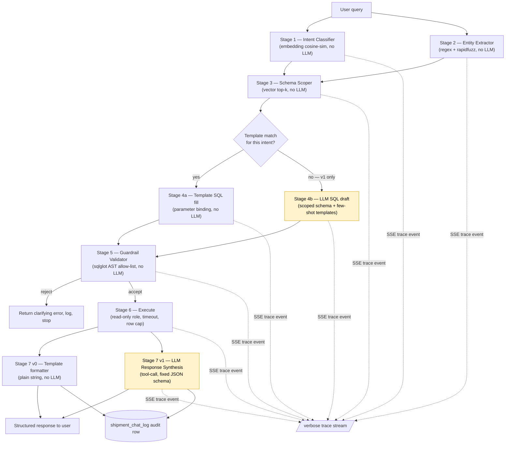

# Agentic RAG Architecture — Shipment Journey Summary Chat

Design for the AI chat feature specified in `Phase1_Shipment_Customer_Design_Document.docx`
(§4) and grounded in `02_phase1_agentic_schema.json`. Status: **v0 implemented** in
`backend/chat/` (see `README.md` implementation-status table and the `/api/chat` endpoint
docs) — Stages 1-3, 4a, 5, 6, and the v0 Stage 7 template formatter are live and tested
end-to-end against the seeded database. v1 (Stage 4b LLM SQL fallback + LLM Stage 7
synthesis) is still design-only.

## 1. Design principles (from requirements)

| Requirement | How this design satisfies it |
|---|---|
| Understand user query → pick right entities/relationships | Deterministic NLU stage (embeddings + fuzzy matching), not an LLM call |
| Accurate SQL generation | Template-first, LLM only fills gaps, output is AST-validated before it can touch the DB |
| Return details in an expected format | LLM's final step is a **tool-call with a fixed JSON schema**, not free text |
| Guardrails on DB access / query generation | Read-only DB role + SQL allow-list validator + row/time limits, defense in depth |
| Minimize LLM load, tokens, hallucination | Programmatic entity/schema matching narrows what the LLM ever sees to ~1 table's worth of schema |
| Visible "thinking" trace | Every pipeline stage emits a structured SSE event; gated behind a `verbose` privilege |
| Comparisons at programming level | Intent + entity + schema selection is cosine-similarity/regex/fuzzy-match code — the LLM never chooses *which* tables exist |
| Scalable | Schema knowledge lives entirely in `02_phase1_agentic_schema.json`; adding Phase 2 tables is a data change, not a code change |
| Low-risk rollout | Ship the deterministic backbone first with **zero LLM calls** (v0), add the two narrow LLM touchpoints once it's proven (v1) |

## 2. Rollout plan: v0 → v1

The pipeline is 7 stages, but only Stage 4b and Stage 7 ever call an LLM. Splitting the build
this way means the guardrails, scoping, and DB-access path get proven against the real
database **before** any LLM-generated SQL exists — the riskiest component is added last, on
top of an already-working, already-tested backbone.

| Stage | v0 — ship first (zero LLM calls) | v1 — add once v0 is live |
|---|---|---|
| 1. Intent Classifier | ✅ embedding cosine-sim against `query_patterns` | unchanged |
| 2. Entity Extractor | ✅ regex + rapidfuzz + dateparser | unchanged |
| 3. Schema Scoper | ✅ vector top-k over entities/views | unchanged |
| 4. SQL Generation | ✅ **4a only** — template fill for known intents; unmatched queries get a static "I can currently only answer questions about tracking status, delay reasons, customs, and open issues" response | ➕ **4b** — LLM drafts SQL for low-confidence/unmatched queries, given the Stage-3 entity slice *plus* the 2-3 nearest existing templates as few-shot examples (reusing Stage 1's ranking) |
| 5. Guardrail Validator | ✅ full `sqlglot` validator — runs even in v0, protecting template output too (defense in depth from day one) | unchanged, now also gates 4b's output |
| 6. Execute | ✅ pooled, read-only, timeout, row cap | unchanged |
| 7. Response Formatting | ✅ **plain string templates** per intent (e.g. `f"Your package is currently {status}..."`) | ➕ replaces the template formatter with an **LLM tool-call** for natural phrasing and to handle 4b's ad-hoc results |
| LLM calls per request | **0** | up to 2 |
| New dependency | `sentence-transformers`, `rapidfuzz`, `dateparser`, `sqlglot`, `asyncpg`, `sse-starlette` | + Anthropic SDK |

v0 already covers the majority of expected traffic — the five `query_patterns` intents already
defined in the schema JSON (where-is-it, why-is-it-late, customs status, open issues, top
customers) — end to end, fully guardrailed, fully testable, with deterministic output. v1 only
extends coverage to ad-hoc/analytical phrasing and upgrades response quality; it does not touch
Stages 1-3, 5, or 6.

## 3. Pipeline overview



Stages 1 and 2 have no dependency on each other — both only need the raw query text — so they
run **concurrently** (`asyncio.gather`), not strictly in sequence; Stage 3 is the first point
that needs both results. This shaves latency without changing the safety model.

## 4. Stage-by-stage detail

### Stage 1 — Intent Classifier `[v0]` (programmatic)

`02_phase1_agentic_schema.json.agent_context.query_patterns` already gives 6 intents, each
with an `example_nl`. Reuse it directly as a few-shot embedding bank instead of hand-coding
an intent list twice:

```python
# built once at startup, cached in memory — not per-request
INTENT_BANK = [
    (p["intent"], p["example_nl"], embed(p["example_nl"]))
    for p in schema_json["agent_context"]["query_patterns"]
]

def classify_intent(query: str) -> tuple[str, float]:
    q_vec = embed(query)
    intent, _, score = max(
        ((i, ex, cosine(q_vec, v)) for i, ex, v in INTENT_BANK),
        key=lambda t: t[2],
    )
    return intent, score
```

- Embedding model: **`sentence-transformers/all-MiniLM-L6-v2`** — 22 MB, runs on CPU in
  <10 ms, no external API call, no per-query cost.
- Runs concurrently with Stage 2 (see §3) — both only need the raw query text.
- In v0, if the top score is below a confidence threshold (e.g. 0.55) the query falls through
  to the static "I can currently answer..." response (see §2). In v1, the same low-confidence
  case instead routes to Stage 4b.
- This list grows by editing the JSON's `query_patterns` array — no code change.
- The scorer computes a similarity ranking over *every* template, not just the winner — v0 only
  ever reads index 0 of that ranking. v1's Stage 4b reuses the same ranking (indices 1-3, or all
  of it if index 0 didn't clear the threshold) to pick few-shot example templates — see Stage 4b.
  No new ranking logic needed, just a second consumer of the same computation.

### Stage 2 — Entity Extractor `[v0]` (programmatic)

Pulls concrete values out of the query text so the LLM never has to "remember" or invent
them. Runs concurrently with Stage 1 (see §3).

| Entity | Method | Library |
|---|---|---|
| `tracking_id` | Regex `\b\d{9,15}\b` (matches the schema's `VARCHAR(40)` numeric tracking numbers) | `re` |
| `current_status`, `issue_type`, `reason_for_delay`, etc. (enum values) | Fuzzy match against `allowed_values` arrays already listed per-field in the schema JSON | `rapidfuzz` |
| `org_name` / customer references | Fuzzy match against a cached list of `customers.org_name` (small table, ~800 rows — cache in memory, refresh periodically) | `rapidfuzz` |
| Dates ("last week", "since Monday") | `dateparser` (handles relative dates) | `dateparser` |

Every extracted value carries a match score; low-confidence extractions are surfaced in the
trace and, if load-bearing for the query, trigger a clarifying question instead of guessing.

### Stage 3 — Schema Scoper `[v0]` (programmatic — the key hallucination-reduction step)

Precompute one embedding per entity/view **description** in `02_phase1_agentic_schema.json`
at startup (5 tables + 1 grounded-context view + 9 dashboard views = 15 vectors, trivial to
hold in memory — no vector DB needed at this scale).

```python
SCHEMA_INDEX = {
    name: embed(f"{obj['description']} fields: {', '.join(obj.get('fields', obj.get('columns', {})))}")
    for name, obj in {**schema_json["entities"], **schema_json["views"]}.items()
}

def scope_schema(query: str, intent: str, top_k: int = 4) -> list[str]:
    q_vec = embed(query)
    ranked = sorted(SCHEMA_INDEX, key=lambda n: -cosine(q_vec, SCHEMA_INDEX[n]))
    return ranked[:top_k]
```

`top_k=4`, not 2 — tuned empirically, not guessed. For genuinely multi-entity questions (e.g. "group
shipments by package type and show how many are delayed"), scores 3-9 often cluster within
~0.02-0.07 of each other — there's no clean gap to cut at 2. Measured case: for that exact
query, the raw `shipment` entity (needed for `package_type`/`package_size`/`package_weight_kg`
grouping — no view exposes those columns) ranked #4 at 0.465 vs #3 `customer` at 0.469,
effectively a tie that `top_k=2` missed entirely. Getting `shipment` reliably scoped also
required rewording its schema-JSON description to explicitly name its groupable columns (raw
entity descriptions didn't originally mention them) — `top_k` alone wasn't enough; the
description and the cutoff are two separate, complementary levers, not substitutes for each
other. See §8 "Raw-table access for ad-hoc grouping" below for what this unlocks and its limits.

The result (e.g. `["shipment", "v_shipment_journey_summary"]`) is used to slice the full JSON
schema down to **only those entities' field dictionaries**. In v0 this scoped list feeds
Stage 5's allow-list even though nothing is sent to an LLM yet; in v1 it's also one of the three
inputs serialized into Stage 4b's prompt (schema slice + few-shot templates + query — see Stage
4b) — for common intents that means the LLM sees ~30 lines of schema instead of the full ~500,
directly cutting tokens and the surface area for hallucinated table/column names. Crucially,
this scoped list is also what Stage 5 validates 4b's output against — so even if a few-shot
example template shown to the model referenced a table outside this query's scope, the model's
actual output still can't touch it.

### Stage 4a — Template SQL `[v0]` (no LLM, preferred path)

Each `query_pattern` in the schema JSON already carries a `recommended_query` with `$1`-style
placeholders. For the ~80% of traffic that's "where is it" / "why is it late" /
"open issues on this shipment" / "customs status", Stage 4a just binds the Stage-2-extracted
values into that template with a parameterized `psycopg2`/`asyncpg` call. **No LLM call at
all** for these — zero token cost, zero hallucination risk. This is the only SQL-generation
path that exists in v0.

### Stage 4b — LLM SQL draft `[v1 addition]` (fallback only)

Reached only when Stage 4a returns no match — either Stage 1's intent confidence was too low,
or a required entity (e.g. `tracking_id`) was missing. Does not exist in v0 — those queries get
the static fallback response instead. Waterfall, not merge: Stage 4a is always tried first,
every time, forever — see `pipeline.py`'s `if filled is None:` branch point.

Three things go into this call, all filtered to relevance — never the full schema, and never
the full template library:

1. **The user's query**, verbatim.
2. **The Stage-3-scoped schema slice** — field dictionaries for only the entities Stage 3
   ranked highest, not the full ~500-line schema JSON. This doubles as the allow-list surface:
   the model is told "SELECT only, from the tables listed above, no other tables exist," and
   Stage 5 enforces that independently of whether the model listens.
3. **The 2-3 nearest existing templates as few-shot examples** — reusing Stage 1's *ranking*,
   not just its top-1 pick (v0 only reads index 0; this is v1's second consumer of the same
   computation). Schema tells the model *what exists*; showing it 2-3 real, already-safe queries
   tells it *how this system queries it* — parameter-binding style, which filters pair with
   which tables, house idioms — which is a different and complementary kind of grounding.

```python
def draft_sql(query: str, scoped_entities: list[str]) -> dict:
    schema_slice = {e: full_schema[e] for e in scoped_entities}   # = Stage 5's allow-list too
    nearby_templates = rank_templates_by_similarity(query)[:3]     # Stage 1's ranking, reused
    prompt = build_prompt(query, schema_slice, nearby_templates)
    return llm_tool_call(prompt, tool_schema={"sql": str, "explanation": str})
```

- **Why only the top 2-3 templates, not the whole library**: identical reasoning to Stage 3's
  schema scoping. As `sql_templates.py` grows from 6 templates today to 30, then 100, showing
  all of them would silently undo the point of scoping down — token cost would grow with the
  template library instead of staying flat, and irrelevant examples add noise the model has to
  reason past instead of useful signal.
- **Tool-use / structured output** forces the model to return `{"sql": "...", "explanation": "..."}` —
  never free-form text that has to be parsed out of a chat response.
- Model tier: a smaller/cheaper model (e.g. Claude Haiku 4.5) is sufficient here because the
  scoped schema is tiny and the task is narrow; escalate to a stronger model only if Stage 5
  rejects the SQL twice in a row.
- **Stage 5 doesn't change for this.** It validates against the Stage-3 allow-list regardless of
  which stage produced the SQL or what the few-shot example templates happened to reference — an
  example template touching a table outside this query's scope can't leak permission to the
  model's actual output.

### Stage 5 — Guardrail Validator `[v0]` (no LLM — the safety-critical stage)

Nothing generated in Stage 4a (v0) or 4b (v1) touches the database until it passes this
**static, allow-list-based validator**, regardless of source. Building this in v0 means it's
already battle-tested against real traffic before Stage 4b's LLM-generated SQL ever reaches it:

```python
import sqlglot
from sqlglot import exp

ALLOWED_TABLES = set(scoped_entities)  # from Stage 3 — narrows per-request, not just globally
ALLOWED_COLUMNS = {col for e in scoped_entities for col in schema_fields(e)}

def validate_sql(sql: str) -> str:
    statements = sqlglot.parse(sql, read="postgres")
    if len(statements) != 1:
        raise GuardrailError("exactly one statement is allowed")

    tree = statements[0]
    if not isinstance(tree, exp.Select):
        raise GuardrailError("only SELECT statements are allowed")

    tables = {t.name for t in tree.find_all(exp.Table)}
    if not tables <= ALLOWED_TABLES:
        raise GuardrailError(f"query references tables outside scope: {tables - ALLOWED_TABLES}")

    columns = {c.name for c in tree.find_all(exp.Column)}
    if not columns <= ALLOWED_COLUMNS | {"*"}:
        raise GuardrailError(f"unknown columns: {columns - ALLOWED_COLUMNS}")

    for banned in (exp.Insert, exp.Update, exp.Delete, exp.Drop, exp.Alter, exp.Into):
        if tree.find(banned):
            raise GuardrailError("write/DDL operations are not allowed")

    if not tree.args.get("limit"):
        tree = tree.limit(200)  # hard cap if the generator forgot one

    return tree.sql(dialect="postgres")
```

Defense in depth beyond static validation:

- **DB-level**: a dedicated `agent_ro` Postgres role with `GRANT SELECT` only on the 5 Phase 1
  tables + 10 views (`REVOKE ALL` on everything else, including `information_schema` where
  possible). Even a validator bug can't escalate past what Postgres itself will permit.
- **Session-level**: every agent connection runs inside `SET LOCAL statement_timeout = '3000ms'`
  and a transaction that is always rolled back (belt-and-braces — the role can't write anyway).
- **Row cap**: hard `LIMIT` enforced by the validator (auto-appended if missing).
- **Parameter binding**: Stage-2-extracted values (tracking IDs, dates, enum values) are always
  passed as bound query parameters, never string-interpolated into the SQL text — closes the
  SQL-injection path even if the LLM tried to smuggle a value through free text.
- **Confidence gate**: if Stage 1/4b confidence is low, respond with a clarifying question
  instead of executing a guessed query.

### Stage 6 — Execute `[v0]`

Async connection pool (`asyncpg`), read replica if/when available, query + params from Stage 5.
Returns rows + row count + elapsed time — all three go into the trace and the audit log.

### Stage 7 v0 — Template Response Formatter `[v0]` (no LLM)

Plain Python f-strings keyed by intent, e.g.:

```python
TEMPLATES = {
    "why_is_it_late": "Your package ({tracking_id}) is currently {current_status}. "
                       "Reason: {reason_for_delay} — {delay_comments}. "
                       "Estimated delivery: {estimated_delivery}.",
    "where_is_my_package": "Your package ({tracking_id}) is currently {current_status} "
                            "at {last_location}.",
}

def format_response(intent: str, row: dict) -> dict:
    return {
        "answer": TEMPLATES[intent].format(**row),
        "supporting_data": row,
        "confidence_score": 1.0,  # deterministic template, always "certain"
    }
```

Deterministic and instant, but only covers the fixed set of known intents/phrasings — this is
what v1's LLM synthesis replaces.

### Stage 7 v1 — LLM Response Synthesis `[v1 addition]` (constrained output)

Replaces the v0 template formatter. A second, narrow LLM call: given the row results and the
original question, produce the customer-facing answer **as a tool-call against a fixed
Pydantic schema**, e.g.:

```python
class ShipmentAnswer(BaseModel):
    answer: str                     # natural-language response
    tracking_id: str | None
    current_status: str | None
    confidence_score: float         # 0-1
    supporting_data: dict           # the raw row(s), for UI rendering
    follow_up_suggestions: list[str] = []
```

Forcing structured output here (rather than parsing free text) is itself a guardrail — the
API contract to the frontend never depends on the LLM "remembering" to format things a
certain way, so v1 is a drop-in replacement for v0's formatter without changing what Stage 6
hands downstream. `confidence_score` below 0.75 flags `requires_human_review` per the design
doc, and in both v0 and v1 every interaction (query, SQL used, rows returned, answer,
confidence) is written to `shipment_chat_log` for QA — this doubles as the system's audit
trail from day one.

## 5. Streaming the "thinking" trace `[v0]`

FastAPI + Server-Sent Events (`sse-starlette`) stream one event per pipeline stage — this
exists from v0, since most stages are already real by then:

```json
{"stage": "intent_classified", "detail": {"intent": "why_is_it_late", "confidence": 0.83}}
{"stage": "entities_extracted", "detail": {"tracking_id": "794658312457"}}
{"stage": "schema_scoped", "detail": {"entities": ["shipment", "v_shipment_journey_summary"]}}
{"stage": "sql_generated", "detail": {"sql": "SELECT * FROM v_shipment_journey_summary WHERE tracking_id = $1", "source": "template"}}
{"stage": "sql_validated", "detail": {"status": "accepted"}}
{"stage": "executing", "detail": {}}
{"stage": "rows_returned", "detail": {"count": 1, "elapsed_ms": 12}}
{"stage": "answer_ready", "detail": {"confidence_score": 0.91}}
```

`source` on the `sql_generated` event is `"template"` in v0 always, and `"template" | "llm"`
once v1 adds Stage 4b — the trace format doesn't change between versions.

This is a **privilege**, not a default: `verbose=true` is only honored for roles like
`SUPPORT`/`OPS`/`ADMIN` (checked server-side against the authenticated session, not a client
flag) — end customers only ever receive the final `answer_ready` payload. Gate this in the
route handler before the SSE generator starts emitting intermediate events.

## 6. Suggested backend module layout

Extends the existing `backend/` FastAPI app rather than a separate service:

```
backend/
├── main.py                      # existing hello/health/summary endpoints
├── chat/
│   ├── router.py                 # POST /api/chat (SSE), GET /api/chat/history        [v0]
│   ├── intent.py                 # Stage 1                                             [v0]
│   ├── entities.py               # Stage 2                                             [v0]
│   ├── schema_scope.py           # Stage 3 (+ startup-time embedding cache)             [v0]
│   ├── sql_templates.py          # Stage 4a — query_patterns -> parameterized SQL       [v0]
│   ├── guardrails.py             # Stage 5 — sqlglot validator, allow-lists             [v0]
│   ├── executor.py               # Stage 6 — pooled read-only execution                 [v0]
│   ├── respond_template.py       # Stage 7 v0 — plain string formatter per intent       [v0]
│   ├── trace.py                  # SSE event emission helpers                           [v0]
│   ├── pipeline.py               # orchestrates the stages, no framework                [v0, extended in v1]
│   ├── sql_llm.py                # Stage 4b — LLM SQL draft (schema slice + few-shot templates) [v1]
│   └── synthesize.py             # Stage 7 v1 — structured-output LLM call              [v1]
└── schema/
    └── 02_phase1_agentic_schema.json   # single source of truth, loaded at startup
```

`pipeline.py` is intentionally a plain sequential async function, not a LangChain/LangGraph
agent — the control flow is fixed (this is the "keep comparisons at programming level"
requirement), so a graph/agent framework would add indirection without adding capability at
this scale. Going from v0 to v1 is two new files and a couple of `if` branches in
`pipeline.py` (route to 4b when no template matches; call `synthesize.py` instead of
`respond_template.py`), not a rewrite.

## 7. Tech stack summary

| Concern | Choice | Needed from |
|---|---|---|
| API framework | FastAPI (already in repo) | v0 |
| Embeddings | `sentence-transformers` (`all-MiniLM-L6-v2`) | v0 |
| Fuzzy matching | `rapidfuzz` | v0 |
| Date parsing | `dateparser` | v0 |
| SQL parsing/validation | `sqlglot` | v0 |
| DB access | `asyncpg` (or existing `psycopg2` for parity) | v0 |
| Streaming | `sse-starlette` | v0 |
| Audit | `shipment_chat_log` table (already in schema) | v0 |
| LLM calls | Anthropic Python SDK, tool-use/structured output | **v1 only** |

## 8. Scalability path

- **New entities**: adding Phase 2 tables (packages, carriers, route_legs, …) means adding
  them to the schema JSON and re-running the startup embedding cache build — the NLU/scoping
  stages need no code changes.
- **Vector index growth**: an in-memory cosine-similarity loop is fine for ~15-50 entities/views;
  if Phase 2+ grows this materially, swap `schema_scope.py`'s backing store for `pgvector` or
  FAISS without touching Stages 1/2/4-7.
- **More agents**: `agent_context.recommended_agents` in the schema JSON already anticipates
  multiple specialized agents (journey-summary, dashboard-summarizer). Each new agent reuses
  Stages 1-6 unchanged and only needs its own Stage 7 output schema.
- **Governance**: today `shipment_chat_log` is the sole audit surface, matching Phase 1 scope.
  If a later phase needs the deferred `agent_action_log` governance ledger (see the design
  doc's roadmap), the trace events already emitted in §4 are the natural source rows for it —
  no pipeline redesign, just an additional sink.

### Raw-table access for ad-hoc grouping/reporting

The 10 dashboard views are fixed projections — `v_shipment_journey_summary` exposes 16 of the
`shipments` table's 27 columns, and none of the views expose `package_type`, `package_size`,
`package_weight_kg`, `failed_delivery_attempts`, or the pickup/delivery windows at all. A
question like *"group shipments by package type and show how many are delayed"* structurally
cannot be answered from any existing view — those columns just aren't there.

Two ways to unblock a question like that, not mutually exclusive:

1. **Add a new dashboard view** — a `CREATE VIEW` for that specific shape, e.g.
   `v_package_type_delay_breakdown`. Zero pipeline changes (Stages 1-7 don't know or care that a
   view is new — it's just one more scoreable entity in the schema JSON), works in v0 via a new
   `sql_templates.py` entry, and gets proper indexing if it turns out to be asked often. Costs a
   DB migration and only covers the one shape you wrote. Regular views store no data of their
   own (`pg_relation_size` on any of the 10 existing views is 0 bytes — confirmed on the live
   DB) — they recompute from the real tables on every read, so adding more of them doesn't grow
   database storage, only (potentially) query cost at very large table sizes.
2. **Let Stage 3 scope to the raw `shipment` entity instead of a view**, and (once v1 exists)
   let the LLM write its own `GROUP BY` directly against it — `shipment` is already one of the 5
   allow-listed entities with all 27 raw columns in its field dictionary, so this needs zero DB
   changes. This is what `top_k=4` (§4 Stage 3) and the `shipment` description rewording were
   tuned for. **Current limits, worth being explicit about:** (a) it only pays off once v1's
   Stage 4b exists — v0's fixed templates can't construct an arbitrary `GROUP BY` no matter how
   the schema is scoped; (b) it's unindexed ad-hoc aggregation — fine at 25k rows, a full-table
   scan at millions; (c) reliably surfacing the right raw entity depends on Stage 3's ranking,
   which is embedding-similarity-based and was empirically tuned for one example query — a
   materially different phrasing could still miss it, the way `top_k=2` originally did here.

Rule of thumb: raw-table access is the general-purpose fallback for questions you didn't
anticipate; a dedicated view is the right call once a specific grouping turns out to be asked
often enough to be worth optimizing and guaranteeing.

## 9. Corner-case audit (v0)

Ran a live test matrix against the running system rather than reasoning about it in the
abstract. Principle applied throughout: **quality is not traded away to save an LLM call.**
Every fix below is v0-fixable (zero LLM cost) precisely because the risk was in the *gating
logic*, not in Stage 4a/5/6 — a template execution is provably safe (parameterized, guardrailed)
regardless of how confident the intent match was, so being overly conservative about *attempting*
one only threw away quality for no safety benefit. Where a gap turned out to be structural
rather than a gating bug, it's flagged as a genuine v1 requirement instead of being
papered over with more templates.

### What was tested and found

| Query | Before | After | Fix |
|---|---|---|---|
| `"Where is my package 999999999999?"` (real phrasing, nonexistent ID) | Declined — confidence 0.515 < old threshold 0.55 | Correct "not found" answer | Threshold 0.55→0.40 |
| `"has 800000000131 cleared customs yet"` | Declined — 0.526 < 0.55 | Correct `customs_status` answer | Threshold 0.55→0.40 |
| `"My order 800000000131 seems stuck, what's happening"` | Declined — 0.455 < 0.55 | Correct `why_is_it_late` answer | Threshold 0.55→0.40 |
| `"wheres 800000000131"` (casual/typo) | Declined — 0.51 < 0.55 | Correct answer | Threshold 0.55→0.40 |
| `"800000000131"` (bare ID, no verb) | Declined — 0.281, below even the new threshold | Defaults to `where_is_my_package` | New: single-tracking-ID fallback (`pipeline.py`'s `intent_defaulted` branch) |
| `"tell me about shipment 800000000131"` | **New failure introduced by the threshold drop**: matched `ops_daily_briefing` (0.467) — a fleet-wide intent that ignores `tracking_id` — returned a completely irrelevant aggregate report | Overridden to `where_is_my_package`; correct answer | New: fleet-intent override guard — a `tracking_id` in the query is treated as decisive evidence against a fleet-wide match |
| `"Compare shipment 800000000131 and 900000000005..."` | Silently answered about only the first ID — **confidently incomplete**, no indication the second was ignored | Honest decline: "I can look up one shipment at a time... which one?" | New: multi-tracking-ID detection (`entities.py`'s `tracking_ids` list + `pipeline.py`'s pre-routing guard) |
| `"Where is my package 999999999999?"` (again, deeper look) | **Separate bug, unrelated to threshold**: crashed mid-stream with `ForeignKeyViolation` on the audit-log insert — user got nothing, not even the decline message | Answer streams fully; audit row written with `tracking_id=NULL` | `audit.py`: catch `ForeignKeyViolation`, retry once with the unverified reference nulled out — audit logging must never crash the primary response |
| 7 out-of-domain queries ("weather", "reset my password", "tell me a joke", ...) | Correctly declined (0.06-0.304) | Still correctly declined — confirmed no regression from lowering the threshold | Measured the gap first (§4 Stage 1/3) before tuning, not guessed |
| 6 known-good phrasings (one per intent) | Worked | Still work, unchanged | Regression-checked after every fix |

### The FK-violation bug is worth calling out on its own

It wasn't found by reasoning about the design — it was hiding in a table already, from the
very first corner-case test run of this session, and silently swallowed a broken response.
`shipment_chat_log.tracking_id` is a real foreign key to `shipments.tracking_id`
(`ON DELETE SET NULL`). Stage 2 extracts a tracking_id from raw query *text* — it is never
confirmed against the database until Stage 6 runs. Whenever that text doesn't match a real
shipment (typo, cancelled order, made-up number), `_finish()` was passing the unverified value
straight into the audit INSERT, which Postgres correctly rejected — and the unhandled exception
took the whole SSE stream down with it, well after the correct answer ("I couldn't find a
shipment...") had already been computed and was one yield away from reaching the user. This is
the sharpest illustration of the audit rule adopted in the fix: **logging is a side effect and
must never be allowed to crash the primary response the user is waiting on.**

### What's still a genuine v0 boundary — not fixed, and not fixable without v1

- **True multi-shipment comparison** ("which of these two is more delayed and why") — the
  multi-ID guard above stops it from answering *wrong*, but doesn't make it *answerable*.
  Doing this properly needs either two queries + synthesis, or an LLM reasoning across both
  result sets — a Stage 4b/7-v1 job, not a bigger template.
- **Ad-hoc grouping/reporting** ("group shipments by package type...") — covered in §8's
  raw-table section above. Structurally blocked until Stage 4b exists to write the `GROUP BY`.
- **Genuinely novel phrasing outside all 6 known shapes** — the confidence floor (0.40) still
  declines these, correctly. Lowering it further to "catch more" would start eroding the clean
  gap from the true-negative tests above — that's exactly the point where the honest answer is
  "build Stage 4b," not "keep lowering the threshold."

These three are the concrete, evidence-based v1 priority list — not a hypothetical one.
