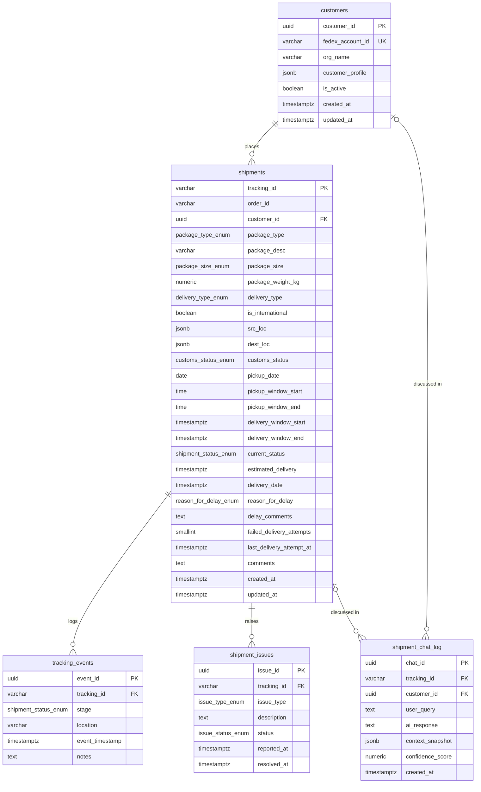

# Database Schema

Reference for the Phase 1 data model — 5 tables, 7 enum types, 11 views. Target: PostgreSQL 15+.
Source of truth: [`db/init/01_phase1_schema.sql`](db/init/01_phase1_schema.sql) and
[`db/init/02_dashboard_summary_views.sql`](db/init/02_dashboard_summary_views.sql).

`tracking_id` (a string, not a UUID) is the shipment primary key — it's the stable,
externally-visible identifier customers and the AI chat agent key off.

## Entity-relationship diagram

## Tables

### 1. `customers` — the organization / account holder

| Column | Type | Notes |
|---|---|---|
| `customer_id` | `UUID` PK | `gen_random_uuid()` default |
| `fedex_account_id` | `VARCHAR(30)` UNIQUE | external account number |
| `org_name` | `VARCHAR(200)` | display name |
| `customer_profile` | `JSONB` | free-form profile detail |
| `is_active` | `BOOLEAN` | default `TRUE` |
| `created_at` / `updated_at` | `TIMESTAMPTZ` | `updated_at` auto-refreshed by trigger |

### 2. `shipments` — tracking-ID-centric core entity

The widest table — package, customs, pickup, and delivery-appointment detail are all folded in
rather than split into satellite tables, since they're 1:1 with a shipment.

| Column | Type | Notes |
|---|---|---|
| `tracking_id` | `VARCHAR(40)` PK | externally-visible ID, not a UUID |
| `order_id` | `VARCHAR(50)` | |
| `customer_id` | `UUID` FK → `customers` | |
| `package_type` | `package_type_enum` | |
| `package_desc` | `VARCHAR(255)` | |
| `package_size` | `package_size_enum` | coupled to `package_type` at seed time |
| `package_weight_kg` | `NUMERIC(10,3)` | coupled to `package_size` at seed time |
| `delivery_type` | `delivery_type_enum` | |
| `is_international` | `BOOLEAN` | |
| `src_loc` / `dest_loc` | `JSONB` | structured location objects |
| `customs_status` | `customs_status_enum` | default `NOT_REQUIRED` |
| `pickup_date`, `pickup_window_start/end` | `DATE` / `TIME` | |
| `delivery_window_start/end` | `TIMESTAMPTZ` | |
| `current_status` | `shipment_status_enum` | default `LABEL_CREATED`; drives the auto-journey-log trigger |
| `estimated_delivery` / `delivery_date` | `TIMESTAMPTZ` | |
| `reason_for_delay` | `reason_for_delay_enum` | default `NONE` |
| `delay_comments` | `TEXT` | |
| `failed_delivery_attempts` | `SMALLINT` | default `0` |
| `last_delivery_attempt_at` | `TIMESTAMPTZ` | |
| `comments` | `TEXT` | |
| `created_at` / `updated_at` | `TIMESTAMPTZ` | `updated_at` auto-refreshed by trigger |

### 3. `tracking_events` — append-only journey log

One row per stage transition. Populated automatically by `trg_shipments_stage_history`
whenever `shipments.current_status` changes (the bulk seeder disables this trigger by name so
it can insert its own back-dated, authoritative history instead).

| Column | Type | Notes |
|---|---|---|
| `event_id` | `UUID` PK | |
| `tracking_id` | `VARCHAR(40)` FK → `shipments`, `ON DELETE CASCADE` | |
| `stage` | `shipment_status_enum` | shares the enum with `shipments.current_status` |
| `location` | `VARCHAR(200)` | |
| `event_timestamp` | `TIMESTAMPTZ` | default `now()` |
| `notes` | `TEXT` | distinguishes routine checkpoints from genuine incidents |

### 4. `shipment_issues` — one row per delay / failed-delivery / RCA incident

| Column | Type | Notes |
|---|---|---|
| `issue_id` | `UUID` PK | |
| `tracking_id` | `VARCHAR(40)` FK → `shipments`, `ON DELETE CASCADE` | |
| `issue_type` | `issue_type_enum` | |
| `description` | `TEXT` | the real incident description — what causal ("why") questions ground against |
| `status` | `issue_status_enum` | default `OPEN` |
| `reported_at` / `resolved_at` | `TIMESTAMPTZ` | |

### 5. `shipment_chat_log` — audit log of every AI chat interaction

| Column | Type | Notes |
|---|---|---|
| `chat_id` | `UUID` PK | |
| `tracking_id` | `VARCHAR(40)` FK → `shipments`, `ON DELETE SET NULL` | nullable — not every question is shipment-specific |
| `customer_id` | `UUID` FK → `customers`, `ON DELETE SET NULL` | nullable |
| `user_query` / `ai_response` | `TEXT` | |
| `context_snapshot` | `JSONB` | |
| `confidence_score` | `NUMERIC(5,4)` | |
| `created_at` | `TIMESTAMPTZ` | |

## Enum types

| Enum | Values |
|---|---|
| `package_type_enum` | `BOX`, `ENVELOPE`, `TUBE`, `CRATE`, `PALLET`, `CUSTOM` |
| `package_size_enum` | `SMALL`, `MEDIUM`, `LARGE`, `EXTRA_LARGE`, `PALLET_SIZED` |
| `delivery_type_enum` | `STANDARD`, `EXPRESS`, `OVERNIGHT`, `ECONOMY`, `INTERNATIONAL_PRIORITY` |
| `customs_status_enum` | `NOT_REQUIRED`, `PENDING`, `HELD`, `CLEARED`, `REJECTED` |
| `shipment_status_enum` | `LABEL_CREATED`, `SHIPMENT_CREATED`, `PACKAGE_RECEIVED`, `TRACKING_ID_ISSUED`, `IN_TRANSIT_TO_ORIGIN_HUB`, `AT_DISTRIBUTION_HUB`, `IN_TRANSIT`, `AT_CONNECTING_HUB`, `CUSTOMS_HOLD`, `CUSTOMS_CLEARED`, `IN_TRANSIT_TO_DESTINATION_HUB`, `OUT_FOR_DELIVERY`, `DELIVERED`, `DELIVERY_FAILED`, `RETURNED_TO_SENDER`, `LOST`, `CANCELLED` — 13 happy-path stages + 4 terminal-failure states |
| `reason_for_delay_enum` | `NONE`, `CUSTOMS`, `WEATHER`, `CIVIL_UNREST`, `LOST_PACKAGE`, `MECHANICAL_ISSUE`, `ADDRESS_ISSUE`, `OTHER` |
| `issue_type_enum` | `CUSTOMS_HOLD`, `WEATHER_DELAY`, `CIVIL_UNREST`, `LOST_PACKAGE`, `FAILED_DELIVERY_ATTEMPT`, `ADDRESS_ISSUE`, `OTHER` |
| `issue_status_enum` | `OPEN`, `INVESTIGATING`, `RESOLVED`, `CLOSED` |

## Triggers

| Trigger | Table | Fires on | Effect |
|---|---|---|---|
| `trg_customers_updated_at` | `customers` | `BEFORE UPDATE` | sets `updated_at = now()` |
| `trg_shipments_updated_at` | `shipments` | `BEFORE UPDATE` | sets `updated_at = now()` |
| `trg_shipments_stage_history` | `shipments` | `AFTER INSERT OR UPDATE OF current_status` | inserts a `tracking_events` row (disabled during bulk seeding so back-dated history can be inserted directly) |

## Views

### Chat-grounding view

| View | Purpose |
|---|---|
| `v_shipment_journey_summary` | Single JSON-friendly payload per `tracking_id` — status, customs, ETA, delay reason, open-issue count, and the full ordered `journey_timeline` (from `tracking_events`). This is what the AI chat's "history/timeline" questions are grounded against. |

### Dashboard summary views

Cheap aggregate queries, safe to run on every page load — this is what backs the real-time
dashboard and the chat agent's 10 aggregate templates.

| View | Purpose |
|---|---|
| `v_status_breakdown` | Shipment count + % of total, grouped by `current_status` |
| `v_ontime_performance` | Delivered/on-time/late counts, on-time %, avg delay hours, in-transit-overdue count |
| `v_delay_reason_breakdown` | Count + % of delayed shipments, grouped by `reason_for_delay` |
| `v_open_issues_summary` | Issue count + avg age/resolution time, grouped by `issue_type` × `status` |
| `v_domestic_vs_international` | Shipment count + customs breakdown, grouped by domestic/international |
| `v_daily_volume_trend` | Created vs. delivered counts per calendar day |
| `v_service_level_mix` | Shipment count + on-time %, grouped by `delivery_type` |
| `v_top_customers` | Top 25 customers by shipment volume, with each one's own on-time % |
| `v_chat_activity_summary` | Total chat interactions, distinct shipments discussed, avg confidence, low-confidence count |
| `v_dashboard_headline` | Single-row, ten-KPI snapshot for the dashboard header — one query, no joins needed by the caller |

## Indexes

| Table | Indexed columns |
|---|---|
| `shipments` | `customer_id`, `current_status`, `reason_for_delay`, `created_at`, `delivery_date`, `estimated_delivery`, `is_international`, `customs_status`, `delivery_type` |
| `tracking_events` | `tracking_id`, `event_timestamp` |
| `shipment_issues` | `tracking_id`, (`issue_type`, `status`) |
| `shipment_chat_log` | `tracking_id`, `confidence_score` |
